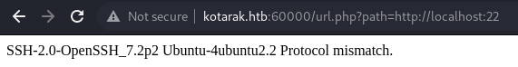
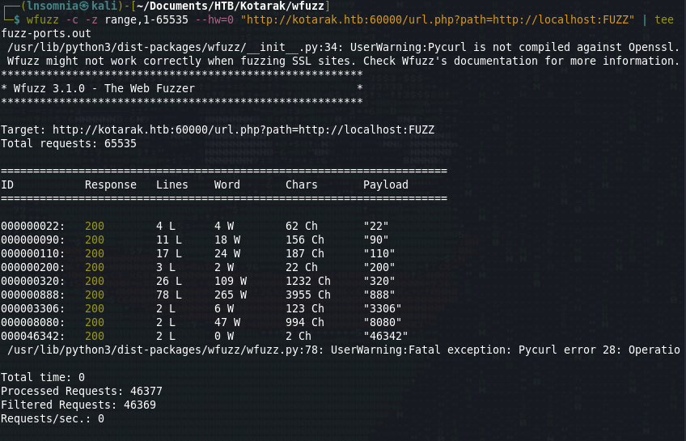
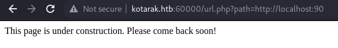
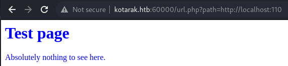
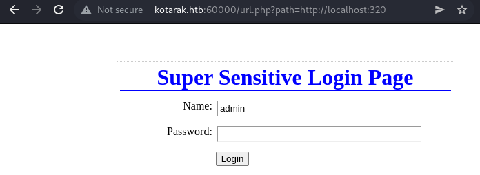
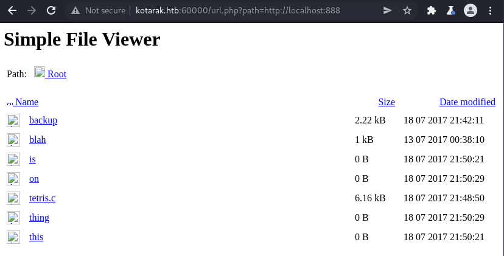
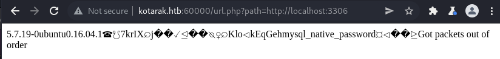

# Recon

I do my initial scan to see which ports are open.
## nmap
```
# Nmap 7.92 scan initiated Tue Jul  5 18:16:01 2022 as: nmap -p- -oA first/scan --min-rate 5000 --max-retries 3 --stylesheet https://raw.githubusercontent.com/honze-net/nmap-bootstrap-xsl/master/nmap-bootstrap.xsl -vv kotarak.htb
Nmap scan report for kotarak.htb (10.129.1.117)
Host is up, received echo-reply ttl 63 (0.062s latency).
Scanned at 2022-07-05 18:16:01 CDT for 13s
Not shown: 65531 closed tcp ports (reset)
PORT      STATE SERVICE    REASON
22/tcp    open  ssh        syn-ack ttl 63
8009/tcp  open  ajp13      syn-ack ttl 63
8080/tcp  open  http-proxy syn-ack ttl 63
60000/tcp open  unknown    syn-ack ttl 63

Read data files from: /usr/bin/../share/nmap
# Nmap done at Tue Jul  5 18:16:14 2022 -- 1 IP address (1 host up) scanned in 13.39 seconds
```

Then run `nmap` again with default scripts (`-sC`) and service discovery (`-sV`) on the ports that were found from the first scan.
```
# Nmap 7.92 scan initiated Tue Jul  5 18:18:23 2022 as: nmap -oA main/scan -sV -sC --min-rate 5000 --max-retries 3 --stylesheet https://raw.githubusercontent.com/honze-net/nmap-bootstrap-xsl/master/nmap-bootstrap.xsl -vv -p 22,8009,8080,60000 kotarak.htb
Nmap scan report for kotarak.htb (10.129.1.117)
Host is up, received echo-reply ttl 63 (0.066s latency).
Scanned at 2022-07-05 18:18:23 CDT for 53s

PORT      STATE SERVICE REASON         VERSION
22/tcp    open  ssh     syn-ack ttl 63 OpenSSH 7.2p2 Ubuntu 4ubuntu2.2 (Ubuntu Linux; protocol 2.0)
| ssh-hostkey: 
|   2048 e2:d7:ca:0e:b7:cb:0a:51:f7:2e:75:ea:02:24:17:74 (RSA)
| ssh-rsa AAAAB3NzaC1yc2EAAAADAQABAAABAQDDfAOLS+7h/C5JtTGQ7mr9dM70qpnhrk8tFSZFncNSMFyfw3JTg16I2KddMFRr3a/+qv+aAfF1VxyUuJl+tXlgvjgH3pRG/mDCl90U6zhz/WVqPaeu8TIu/1ph+mUZHyss/bCVrt5mnbb1nG/AeDnX/+IiUINIdkgMB6aIOtC+B+zKV/aIrk84HgV4IwfC03a2R7FRPwVzjCv97jhWjvqBEYt4UudazAmkBjgEC9xlJ9r8MjV/DrJ6M66rjCTeuLmiB3a/qz+CbC4k/uey2b5D0p5nxMGkINjgL8X1t8BbGj1qOAS+HWWxQETuwYNVpTLeNuy1bev4kd2BZyewut/p
|   256 e8:f1:c0:d3:7d:9b:43:73:ad:37:3b:cb:e1:64:8e:e9 (ECDSA)
| ecdsa-sha2-nistp256 AAAAE2VjZHNhLXNoYTItbmlzdHAyNTYAAAAIbmlzdHAyNTYAAABBBEvZEilkawbySka+4LZlqha3pjcW2T4wq8WM1cwg/DscLCxypOIh2bRkMitpUOz1kMftIZSGNdmERXvi0znPWFI=
|   256 6d:e9:26:ad:86:02:2d:68:e1:eb:ad:66:a0:60:17:b8 (ED25519)
|_ssh-ed25519 AAAAC3NzaC1lZDI1NTE5AAAAID8PURIGd2/vCi9d91JK1f8wlyKrIPLcBBVVFsP8YXQ3
8009/tcp  open  ajp13   syn-ack ttl 63 Apache Jserv (Protocol v1.3)
| ajp-methods: 
|   Supported methods: GET HEAD POST PUT DELETE OPTIONS
|   Potentially risky methods: PUT DELETE
|_  See https://nmap.org/nsedoc/scripts/ajp-methods.html
8080/tcp  open  http    syn-ack ttl 63 Apache Tomcat 8.5.5
|_http-title: Apache Tomcat/8.5.5 - Error report
|_http-favicon: Apache Tomcat
| http-methods: 
|   Supported Methods: GET HEAD POST PUT DELETE OPTIONS
|_  Potentially risky methods: PUT DELETE
60000/tcp open  http    syn-ack ttl 63 Apache httpd 2.4.18 ((Ubuntu))
|_http-title:         Kotarak Web Hosting        
| http-methods: 
|_  Supported Methods: GET HEAD POST OPTIONS
|_http-server-header: Apache/2.4.18 (Ubuntu)
Service Info: OS: Linux; CPE: cpe:/o:linux:linux_kernel

Read data files from: /usr/bin/../share/nmap
Service detection performed. Please report any incorrect results at https://nmap.org/submit/ .
# Nmap done at Tue Jul  5 18:19:16 2022 -- 1 IP address (1 host up) scanned in 52.61 seconds
```

I also ran a UDP scan, vuln scan and fuzzed for subdomains but didn't get anything back, so it looks like we are just working with Apache Tomcat on port 8080, Apache JServ Protocol which works in tandem with Tomcat, port 60000 (which seems odd!) and then the classic port 22. 

# Enumeration

## Nikto
#### Port 8080
We see the PUT method is allowed and some manager related interfaces are found. 
```
- Nikto v2.1.6/2.1.5
+ Target Host: kotarak.htb
+ Target Port: 8080
+ GET The anti-clickjacking X-Frame-Options header is not present.
+ GET The X-XSS-Protection header is not defined. This header can hint to the user agent to protect against some forms of XSS
+ GET The X-Content-Type-Options header is not set. This could allow the user agent to render the content of the site in a different fashion to the MIME type
+ OSVDB-39272: GET /favicon.ico file identifies this app/server as: Apache Tomcat (possibly 5.5.26 through 8.0.15), Alfresco Community
+ OPTIONS Allowed HTTP Methods: GET, HEAD, POST, PUT, DELETE, OPTIONS 
+ OSVDB-397: GET HTTP method ('Allow' Header): 'PUT' method could allow clients to save files on the web server.
+ OSVDB-5646: GET HTTP method ('Allow' Header): 'DELETE' may allow clients to remove files on the web server.
+ GET /examples/servlets/index.html: Apache Tomcat default JSP pages present.
+ OSVDB-3720: GET /examples/jsp/snp/snoop.jsp: Displays information about page retrievals, including other users.
+ GET /manager/html: Default Tomcat Manager / Host Manager interface found
+ GET /host-manager/html: Default Tomcat Manager / Host Manager interface found
+ GET /manager/status: Default Tomcat Server Status interface found
```

#### Port 60000
Nikto found a RFI through `info.php`
```
- Nikto v2.1.6
---------------------------------------------------------------------------
+ Target IP:          10.129.1.117
+ Target Hostname:    kotarak.htb
+ Target Port:        60000
+ Start Time:         2022-07-05 18:24:17 (GMT-5)
---------------------------------------------------------------------------
+ Server: Apache/2.4.18 (Ubuntu)
+ The anti-clickjacking X-Frame-Options header is not present.
+ The X-XSS-Protection header is not defined. This header can hint to the user agent to protect against some forms of XSS
+ The X-Content-Type-Options header is not set. This could allow the user agent to render the content of the site in a different fashion to the MIME type
+ No CGI Directories found (use '-C all' to force check all possible dirs)
+ Apache/2.4.18 appears to be outdated (current is at least Apache/2.4.37). Apache 2.2.34 is the EOL for the 2.x branch.
+ Web Server returns a valid response with junk HTTP methods, this may cause false positives.
+ /info.php: Output from the phpinfo() function was found.
+ OSVDB-3233: /info.php: PHP is installed, and a test script which runs phpinfo() was found. This gives a lot of system information.
+ OSVDB-3233: /icons/README: Apache default file found.
+ OSVDB-5292: /info.php?file=http://cirt.net/rfiinc.txt?: RFI from RSnake's list (http://ha.ckers.org/weird/rfi-locations.dat) or from http://osvdb.org/
+ 7788 requests: 0 error(s) and 9 item(s) reported on remote host
+ End Time:           2022-07-05 18:33:22 (GMT-5) (545 seconds)
---------------------------------------------------------------------------
+ 1 host(s) tested
```

## Feroxbuster
#### Port 8080
Not a whole lot to see -- it is all default Tomcat directories and files.
```
302      GET        0l        0w        0c http://kotarak.htb:8080/docs => /docs/
302      GET        0l        0w        0c http://kotarak.htb:8080/docs/images => /docs/images/
302      GET        0l        0w        0c http://kotarak.htb:8080/examples => /examples/
302      GET        0l        0w        0c http://kotarak.htb:8080/docs/api => /docs/api/
302      GET        0l        0w        0c http://kotarak.htb:8080/docs/architecture => /docs/architecture/
302      GET        0l        0w        0c http://kotarak.htb:8080/docs/config => /docs/config/
302      GET        0l        0w        0c http://kotarak.htb:8080/examples/jsp => /examples/jsp/
302      GET        0l        0w        0c http://kotarak.htb:8080/examples/jsp/images => /examples/jsp/images/
302      GET        0l        0w        0c http://kotarak.htb:8080/examples/jsp/security => /examples/jsp/security/
302      GET        0l        0w        0c http://kotarak.htb:8080/examples/jsp/xml => /examples/jsp/xml/
302      GET        0l        0w        0c http://kotarak.htb:8080/examples/jsp/forward => /examples/jsp/forward/
302      GET        0l        0w        0c http://kotarak.htb:8080/docs/images/fonts => /docs/images/fonts/
302      GET        0l        0w        0c http://kotarak.htb:8080/examples/jsp/include => /examples/jsp/include/
302      GET        0l        0w        0c http://kotarak.htb:8080/examples/servlets => /examples/servlets/
302      GET        0l        0w        0c http://kotarak.htb:8080/examples/servlets/images => /examples/servlets/images/
302      GET        0l        0w        0c http://kotarak.htb:8080/examples/jsp/error => /examples/jsp/error/
302      GET        0l        0w        0c http://kotarak.htb:8080/examples/jsp/dates => /examples/jsp/dates/
302      GET        0l        0w        0c http://kotarak.htb:8080/manager => /manager/
302      GET        0l        0w        0c http://kotarak.htb:8080/examples/jsp/sessions => /examples/jsp/sessions/
302      GET        0l        0w        0c http://kotarak.htb:8080/manager/images => /manager/images/
401      GET       63l      289w     2473c http://kotarak.htb:8080/manager/html
302      GET        0l        0w        0c http://kotarak.htb:8080/docs/architecture/startup => /docs/architecture/startup/
401      GET       63l      289w     2473c http://kotarak.htb:8080/manager/text
302      GET        0l        0w        0c http://kotarak.htb:8080/examples/jsp/cal => /examples/jsp/cal/
401      GET       63l      289w     2473c http://kotarak.htb:8080/manager/status
302      GET        0l        0w        0c http://kotarak.htb:8080/examples/jsp/plugin => /examples/jsp/plugin/
200      GET       23l       45w      627c http://kotarak.htb:8080/examples/jsp/security/protected
302      GET        0l        0w        0c http://kotarak.htb:8080/examples/jsp/colors => /examples/jsp/colors/
302      GET        0l        0w        0c http://kotarak.htb:8080/examples/jsp/num => /examples/jsp/num/
302      GET        0l        0w        0c http://kotarak.htb:8080/docs/appdev => /docs/appdev/
302      GET        0l        0w        0c http://kotarak.htb:8080/examples/jsp/plugin/applet => /examples/jsp/plugin/applet/
302      GET        0l        0w        0c http://kotarak.htb:8080/docs/appdev/sample => /docs/appdev/sample/
302      GET        0l        0w        0c http://kotarak.htb:8080/docs/appdev/sample/docs => /docs/appdev/sample/docs/
302      GET        0l        0w        0c http://kotarak.htb:8080/docs/appdev/sample/web => /docs/appdev/sample/web/
302      GET        0l        0w        0c http://kotarak.htb:8080/docs/appdev/sample/src => /docs/appdev/sample/src/
302      GET        0l        0w        0c http://kotarak.htb:8080/examples/jsp/checkbox => /examples/jsp/checkbox/
302      GET        0l        0w        0c http://kotarak.htb:8080/examples/jsp/snp => /examples/jsp/snp/
302      GET        0l        0w        0c http://kotarak.htb:8080/examples/jsp/async => /examples/jsp/async/
```

#### Port 60000
Nothing helpful as we discovered `info.php` from Nikto.
```
200      GET     1110l     5668w        0c http://kotarak.htb:60000/info.php
200      GET       76l      130w     1169c http://kotarak.htb:60000/
403      GET       11l       32w      293c http://kotarak.htb:60000/.php
200      GET       76l      130w     1169c http://kotarak.htb:60000/index.php
200      GET        2l        0w        2c http://kotarak.htb:60000/url.php
403      GET       11l       32w      302c http://kotarak.htb:60000/server-status
```

## Website
#### Port 8080

By just browsing around, we see that this seems to probably be a default installation of Tomcat. 
Looking through a cheatsheet for Tomcat pentesting, we know that if we can get access to the Application Manager we can probably upload a `.war` file to get RCE.
https://book.hacktricks.xyz/network-services-pentesting/pentesting-web/tomcat

I try to access the manager which is protected by authentication, although default credentials do not work here.


During my research, I did find that this version of Tomcat is vulnerable to CVE-2020-10487 (Ghostcat) although after quite a bit of poking around, I was only able to read `/WEB-INF/web.xml` which did not contain anything helpful.


#### Port 60000

This page appears to be a "private" search engine of some sort. It actually does not seem to have any working functionality.


Rembering that Nikto flagged an RFI via the `info.php`, I check to see if this works although after testing and reviewing `info.php`, I found that the options for LFI/RFI are actually set to off, so that seems to be a no-go...


There is still something weird about this page, so next I try for SSRF related payloads. I am using this list for reference:
https://pravinponnusamy.medium.com/ssrf-payloads-f09b2a86a8b4

Testing with a `file://` schema returns a "try harder" message.


It seems like this message is returned probably based on a blacklist looking for `file` and other keywords. After playing around with some other payloads, we can see that we can access the server localhost with a specified port.


This makes me curious if there are any services running on localhost, so I fuzz for all ports...








 ...and find tons!

This widens our attack surface TONS! Ports 320 and 888 are most interesting to me, but I will investigate the others as well to make sure I am not missing anything. We also now know there seems to be a MySQL service running on localhost port 3306.


