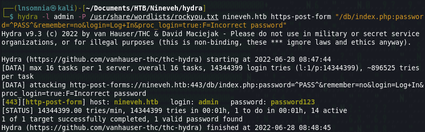
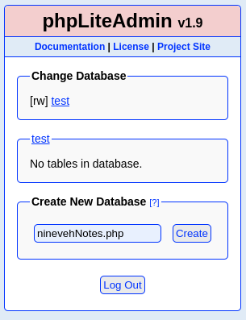

## **Recon**


**Nmap**

```
# Nmap 7.92 scan initiated Sun Jun 26 09:23:25 2022 as: nmap -oA first/scan --min-rate 5000 --max-retries 3 --stylesheet https://raw.githubusercontent.com/honze-net/nmap-bootstrap-xsl/master/nmap-bootstrap.xsl -vv nineveh.htb
Nmap scan report for nineveh.htb (10.129.193.8)
Host is up, received echo-reply ttl 63 (0.054s latency).
Scanned at 2022-06-26 09:23:25 CDT for 1s
Not shown: 998 filtered tcp ports (no-response)
PORT    STATE SERVICE REASON
80/tcp  open  http    syn-ack ttl 63
443/tcp open  https   syn-ack ttl 63

Read data files from: /usr/bin/../share/nmap
# Nmap done at Sun Jun 26 09:23:26 2022 -- 1 IP address (1 host up) scanned in 1.05 seconds
```

Unlike most HTB boxes, this box does not appear to have port 22 open. Only ports 80 and 443! Looking at the script results for 443, we can make note of `admin@nineveh.htb` from the certificate details.

```
# Nmap 7.92 scan initiated Sun Jun 26 09:24:22 2022 as: nmap -oA main/scan -sV -sC --min-rate 5000 --max-retries 3 --stylesheet https://raw.githubusercontent.com/honze-net/nmap-bootstrap-xsl/master/nmap-bootstrap.xsl -vv -p80,443 nineveh.htb
Nmap scan report for nineveh.htb (10.129.193.8)
Host is up, received echo-reply ttl 63 (0.053s latency).
Scanned at 2022-06-26 09:24:23 CDT for 15s

PORT    STATE SERVICE  REASON         VERSION
80/tcp  open  http     syn-ack ttl 63 Apache httpd 2.4.18 ((Ubuntu))
|_http-title: Site doesn't have a title (text/html).
| http-methods: 
|_  Supported Methods: OPTIONS GET HEAD POST
|_http-server-header: Apache/2.4.18 (Ubuntu)
443/tcp open  ssl/http syn-ack ttl 63 Apache httpd 2.4.18
| http-methods: 
|_  Supported Methods: OPTIONS GET HEAD POST
|_http-title: Site doesn't have a title (text/html).
| ssl-cert: Subject: commonName=nineveh.htb/organizationName=HackTheBox Ltd/stateOrProvinceName=Athens/countryName=GR/emailAddress=admin@nineveh.htb/organizationalUnitName=Support/localityName=Athens
| Issuer: commonName=nineveh.htb/organizationName=HackTheBox Ltd/stateOrProvinceName=Athens/countryName=GR/emailAddress=admin@nineveh.htb/organizationalUnitName=Support/localityName=Athens
| Public Key type: rsa
| Public Key bits: 2048
| Signature Algorithm: sha256WithRSAEncryption
| Not valid before: 2017-07-01T15:03:30
| Not valid after:  2018-07-01T15:03:30
| MD5:   d182 94b8 0210 7992 bf01 e802 b26f 8639
| SHA-1: 2275 b03e 27bd 1226 fdaa 8b0f 6de9 84f0 113b 42c0
| -----BEGIN CERTIFICATE-----
| MIID+TCCAuGgAwIBAgIJANwojrkai1UOMA0GCSqGSIb3DQEBCwUAMIGSMQswCQYD
| VQQGEwJHUjEPMA0GA1UECAwGQXRoZW5zMQ8wDQYDVQQHDAZBdGhlbnMxFzAVBgNV
| BAoMDkhhY2tUaGVCb3ggTHRkMRAwDgYDVQQLDAdTdXBwb3J0MRQwEgYDVQQDDAtu
| aW5ldmVoLmh0YjEgMB4GCSqGSIb3DQEJARYRYWRtaW5AbmluZXZlaC5odGIwHhcN
| MTcwNzAxMTUwMzMwWhcNMTgwNzAxMTUwMzMwWjCBkjELMAkGA1UEBhMCR1IxDzAN
| BgNVBAgMBkF0aGVuczEPMA0GA1UEBwwGQXRoZW5zMRcwFQYDVQQKDA5IYWNrVGhl
| Qm94IEx0ZDEQMA4GA1UECwwHU3VwcG9ydDEUMBIGA1UEAwwLbmluZXZlaC5odGIx
| IDAeBgkqhkiG9w0BCQEWEWFkbWluQG5pbmV2ZWguaHRiMIIBIjANBgkqhkiG9w0B
| AQEFAAOCAQ8AMIIBCgKCAQEA+HUDrGgG769A68bslDXjV/uBaw18SaF52iEz/ui2
| WwXguHnY8BS7ZetS4jAso6BOrGUZpN3+278mROPa4khQlmZ09cj8kQ4k7lOIxSlp
| eZxvt+R8fkJvtA7e47nvwP4H2O6SI0nD/pGDZc05i842kOc/8Kw+gKkglotGi8ZO
| GiuRgzyfdaNSWC7Lj3gTjVMCllhc6PgcQf9r7vK1KPkyFleYDUwB0dwf3taN0J2C
| U2EHz/4U1l40HoIngkwfhFI+2z2J/xx2JP+iFUcsV7LQRw0x4g6Z5WFWETluWUHi
| AWUZHrjMpMaXs3TZNNW81tWUP2jBulX5kv6H5CTocsXgyQIDAQABo1AwTjAdBgNV
| HQ4EFgQUh0YSfVOI05WyOFntGykwc3/OzrMwHwYDVR0jBBgwFoAUh0YSfVOI05Wy
| OFntGykwc3/OzrMwDAYDVR0TBAUwAwEB/zANBgkqhkiG9w0BAQsFAAOCAQEAehma
| AJKuLeAHqHAIcLopQg9mE28lYDGxf+3eIEuUAHmUKs0qGLs3ZTY8J77XTxmjvH1U
| qYVXfZSub1IG7LgUFybLFKNl6gioKEPXXA9ofKdoJX6Bar/0G/15YRSEZGc9WXh4
| Xh1Qr3rkYYZj/rJa4H5uiWoRFofSTNGMfbY8iF8X2+P2LwyEOqThypdMBKMiIt6d
| 7sSuqsrnQRa73OdqdoCpHxEG6antne6Vvz3ALxv4cI7SqzKiQvH1zdJ/jOhZK1g1
| CxLUGYbNsjIJWSdOoSlIgRswnu+A+O612+iosxYaYdCUZ8BElgjUAXLEHzuUFtRb
| KrYQgX28Ulf8OSGJuA==
|_-----END CERTIFICATE-----
|_ssl-date: TLS randomness does not represent time
| tls-alpn: 
|_  http/1.1
|_http-server-header: Apache/2.4.18 (Ubuntu)

Read data files from: /usr/bin/../share/nmap
Service detection performed. Please report any incorrect results at https://nmap.org/submit/ .
# Nmap done at Sun Jun 26 09:24:38 2022 -- 1 IP address (1 host up) scanned in 16.27 seconds
```

## **Enumeration**

**Nikto**

Nothing too interesting or anything we didn't already know.

```
- Nikto v2.1.6
---------------------------------------------------------------------------
+ Target IP:          10.129.193.8
+ Target Hostname:    nineveh.htb
+ Target Port:        443
---------------------------------------------------------------------------
+ SSL Info:        Subject:  /C=GR/ST=Athens/L=Athens/O=HackTheBox Ltd/OU=Support/CN=nineveh.htb/emailAddress=admin@nineveh.htb
                   Ciphers:  ECDHE-RSA-AES256-GCM-SHA384
                   Issuer:   /C=GR/ST=Athens/L=Athens/O=HackTheBox Ltd/OU=Support/CN=nineveh.htb/emailAddress=admin@nineveh.htb
+ Start Time:         2022-06-26 10:34:18 (GMT-5)
---------------------------------------------------------------------------
+ Server: Apache/2.4.18 (Ubuntu)
+ The anti-clickjacking X-Frame-Options header is not present.
+ The X-XSS-Protection header is not defined. This header can hint to the user agent to protect against some forms of XSS
+ The site uses SSL and the Strict-Transport-Security HTTP header is not defined.
+ The site uses SSL and Expect-CT header is not present.
+ The X-Content-Type-Options header is not set. This could allow the user agent to render the content of the site in a different fashion to the MIME type
+ No CGI Directories found (use '-C all' to force check all possible dirs)
+ Apache/2.4.18 appears to be outdated (current is at least Apache/2.4.37). Apache 2.2.34 is the EOL for the 2.x branch.
+ Allowed HTTP Methods: OPTIONS, GET, HEAD, POST 
+ Cookie PHPSESSID created without the secure flag
+ Cookie PHPSESSID created without the httponly flag
+ OSVDB-3092: /db/: This might be interesting...
+ OSVDB-3233: /icons/README: Apache default file found.
+ 7785 requests: 0 error(s) and 11 item(s) reported on remote host
+ End Time:           2022-06-26 11:04:29 (GMT-5) (1811 seconds)
---------------------------------------------------------------------------
+ 1 host(s) tested
```


**Ferroxbuster**
(http)
```
|__  |__  |__) |__) | /  `    /  \ \_/ | |  \ |__
|    |___ |  \ |  \ | \__,    \__/ / \ | |__/ |___
by Ben "epi" Risher 🤓                 ver: 2.7.0
───────────────────────────┬──────────────────────
 🎯  Target Url            │ http://nineveh.htb
 🚀  Threads               │ 50
 📖  Wordlist              │ /usr/share/seclists/Discovery/Web-Content/raft-medium-directories.txt
 👌  Status Codes          │ [200, 204, 301, 302, 307, 308, 401, 403, 405, 500]
 💥  Timeout (secs)        │ 7
 🦡  User-Agent            │ feroxbuster/2.7.0
 💉  Config File           │ /etc/feroxbuster/ferox-config.toml
 💲  Extensions            │ [php, txt]
 🏁  HTTP methods          │ [GET]
 🔃  Recursion Depth       │ 4
 🎉  New Version Available │ https://github.com/epi052/feroxbuster/releases/latest
───────────────────────────┴──────────────────────
 🏁  Press [ENTER] to use the Scan Management Menu™
──────────────────────────────────────────────────
200      GET        5l       25w      178c http://nineveh.htb/
403      GET       11l       32w      290c http://nineveh.htb/.php
200      GET      977l     5005w        0c http://nineveh.htb/info.php
403      GET       11l       32w      299c http://nineveh.htb/server-status
301      GET        9l       28w      315c http://nineveh.htb/department => http://nineveh.htb/department/
301      GET        9l       28w      319c http://nineveh.htb/department/css => http://nineveh.htb/department/css/
301      GET        9l       28w      321c http://nineveh.htb/department/files => http://nineveh.htb/department/files/
200      GET        1l        3w       68c http://nineveh.htb/department/index.php
302      GET        0l        0w        0c http://nineveh.htb/department/logout.php => login.php
302      GET        0l        0w        0c http://nineveh.htb/department/manage.php => login.php
200      GET       57l      109w     1560c http://nineveh.htb/department/login.php
200      GET       21l       40w      670c http://nineveh.htb/department/header.php
403      GET       11l       32w      301c http://nineveh.htb/department/.php
200      GET        7l        4w       51c http://nineveh.htb/department/footer.php
200      GET        1l        3w       68c http://nineveh.htb/department/css/index.php
200      GET        1l        3w       68c http://nineveh.htb/department/files/index.php
[####################] - 3m    450000/450000  0s      found:16      errors:2      
[####################] - 2m     90000/90000   559/s   http://nineveh.htb 
[####################] - 2m     90000/90000   559/s   http://nineveh.htb/ 
[####################] - 2m     90000/90000   569/s   http://nineveh.htb/department 
[####################] - 2m     90000/90000   568/s   http://nineveh.htb/department/css 
[####################] - 2m     90000/90000   572/s   http://nineveh.htb/department/file
```

(https)
```
 ___  ___  __   __     __      __         __   ___
|__  |__  |__) |__) | /  `    /  \ \_/ | |  \ |__
|    |___ |  \ |  \ | \__,    \__/ / \ | |__/ |___
by Ben "epi" Risher 🤓                 ver: 2.7.0
───────────────────────────┬──────────────────────
 🎯  Target Url            │ https://nineveh.htb
 🚀  Threads               │ 50
 📖  Wordlist              │ /usr/share/seclists/Discovery/Web-Content/raft-medium-directories.txt
 👌  Status Codes          │ [200, 204, 301, 302, 307, 308, 401, 403, 405, 500]
 💥  Timeout (secs)        │ 7
 🦡  User-Agent            │ feroxbuster/2.7.0
 💉  Config File           │ /etc/feroxbuster/ferox-config.toml
 🤯  Header                │ Cookie: PHPSESSID=jio6ptm9qub9f3hhpcf8805jr6
 💾  Output File           │ https-scan
 💲  Extensions            │ [php, txt]
 🏁  HTTP methods          │ [GET]
 🔓  Insecure              │ true
 🔃  Recursion Depth       │ 4
 🎉  New Version Available │ https://github.com/epi052/feroxbuster/releases/latest
───────────────────────────┴──────────────────────
 🏁  Press [ENTER] to use the Scan Management Menu™
──────────────────────────────────────────────────
200      GET        1l        3w       49c https://nineveh.htb/
403      GET       11l       32w      291c https://nineveh.htb/.php
301      GET        9l       28w      309c https://nineveh.htb/db => https://nineveh.htb/db/
200      GET      484l      956w        0c https://nineveh.htb/db/index.php
[####################] - 34s   270000/270000  0s      found:4       errors:81507  
[####################] - 34s    90000/90000   2619/s  https://nineveh.htb 
[####################] - 23s    90000/90000   3850/s  https://nineveh.htb/ 
[####################] - 26s    90000/90000   3381/s  https://nineveh.htb/db
```


The site greets us with the default Apache installation page. Maybe a misconfigured webserver?


Feroxbuster discovered a php info page, so let's check that out and see if there is anything worth noting...


There is quite a bit of good info, but what really stood out was `allow_url_include` turned on! From experience, I know that this can be used to leverage remote file inclusion. I will keep this in mind while we advance.


There are a few more URL's that Ferroxbuster found for the http site, but they are all locked behind a login.php page. 


Looking at the source, we can make note of two possible users: `admin` and `amrois`. It also looks like the backend will be using MySQL, so this could be helpful to possibly test SQL injection on the login page. Before we do that though, I almost forgot to enumerate the https site!


Not sure if this image is relevent but doing a bit of forensics on it out of curiosity didn't bring back anything interesting. Feroxbuster found `/db/` so let's see what that's all about...


Another login form -- this one is using phpLiteAdmin v1.9. There was one exploit that stood out for this older version but it looks like we need to have backend access. I'll keep this exploit on hand maybe for later use. Unfortunately default passwords did not work. After fumbling around for a while, it seemed like bruteforcing with `hydra` was something worth trying.



Success!


Now, it might be worth revisiting that exploit from earlier but before we do that, I am also going to test the other login form that was found. 

First, let's just test some default credentials.


`admin:admin` results in `Invalid Password!`
`amrois:amrois` results in `invalid username`

Sharing too much error messaging from a login form is a common issue with many web apps, such as WordPress for example! In this case, we can infer that `admin` is a valid user, while `amrois` is not.  Let's pull out `hydra` again:


And within a couple of minutes we have a password! After logging in with `admin:1q2w3e4r5t` we are redirected to what looks like a manage page that is "under construction"


The Notes `href` shows some interesting information:


One of the list items mentions a secret folder... This might have some relevance? These notes are also signed by `amrois`. However, what is most interesting to me, is the way this notes file is included on the page; using `manage.php?notes=files/ninevehNotes.txt` This seems like poor coding practice and could potentially indicate an LFI vulnerability because of the way this particular file is referenced.

I'm not sure which path is the best path, although considering the exploit from earlier looks like it could be used on the currently installed version of phpLiteAdmin, maybe it could be worth trying. I am following the PoC here:
[https://github.com/F-Masood/PHPLiteAdmin-1.9.3---Exploit-PoC](https://github.com/F-Masood/PHPLiteAdmin-1.9.3---Exploit-PoC)

I created the new database and name it `ninevehNotes.php` since the LFI seems to be searching for a file specifically named `ninevehNotes`. 



Give it a `cmd` table...


With the php web shell as the field. 


This works because the `include()` function being used executes the php code from the field of our newly created db.

