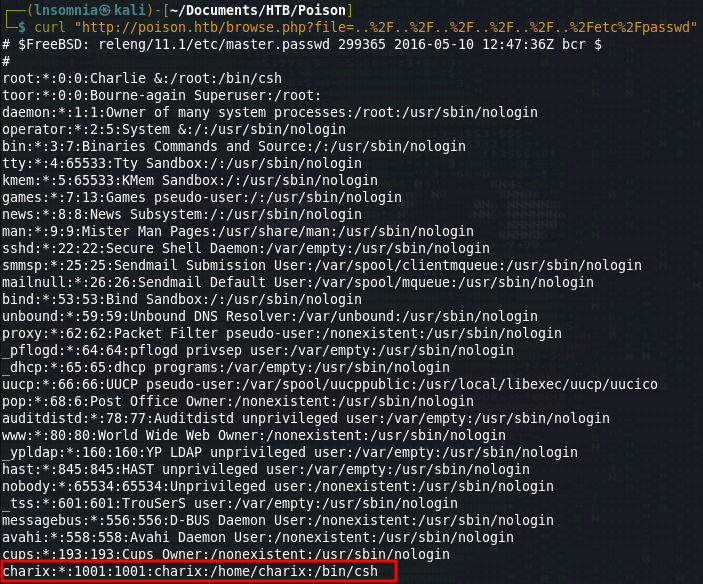
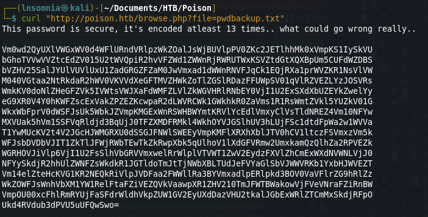
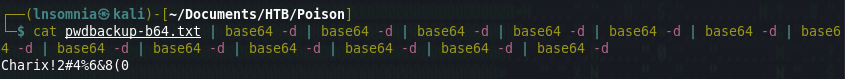

Exploiting LFI found during enumeration leaks `/etc/passwd` resulting in information disclosure of user `Charix`:

During enumeration, `pwdbackup.txt` is found. Reading this file with LFI leaks the base64 encoded password for user `Charix` which decodes to `Charix!2#4%6&8(0`:

