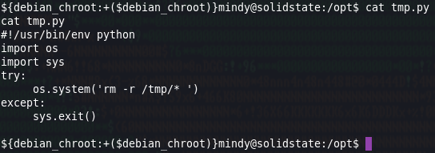
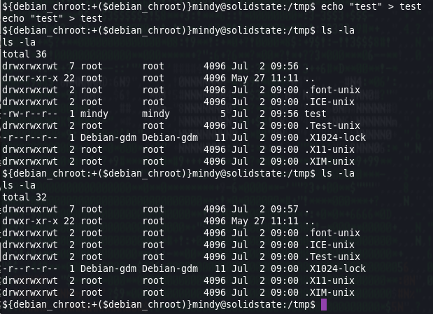
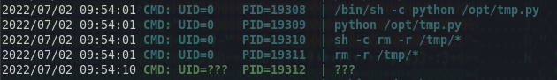

# Enumeration

I do my initial scan to see which ports are open.
## nmap
```
# Nmap 7.92 scan initiated Thu Jun 30 17:58:05 2022 as: nmap -oA first/scan --min-rate 5000 --max-retries 3 --stylesheet https://raw.githubusercontent.com/honze-net/nmap-bootstrap-xsl/master/nmap-bootstrap.xsl -vv solidstate.htb
Nmap scan report for solidstate.htb (10.129.94.185)
Host is up, received echo-reply ttl 63 (0.061s latency).
Scanned at 2022-06-30 17:58:05 CDT for 1s
Not shown: 995 closed tcp ports (reset)
PORT    STATE SERVICE REASON
22/tcp  open  ssh     syn-ack ttl 63
25/tcp  open  smtp    syn-ack ttl 63
80/tcp  open  http    syn-ack ttl 63
110/tcp open  pop3    syn-ack ttl 63
119/tcp open  nntp    syn-ack ttl 63

Read data files from: /usr/bin/../share/nmap
# Nmap done at Thu Jun 30 17:58:06 2022 -- 1 IP address (1 host up) scanned in 0.55 seconds
```

Then run `nmap` again with default scripts (`-sC`) and service discovery (`-sV`) on the ports that were found from the first scan.
```
# Nmap 7.92 scan initiated Thu Jun 30 17:58:25 2022 as: nmap -oA main/scan -sV -sC --min-rate 5000 --max-retries 3 --stylesheet https://raw.githubusercontent.com/honze-net/nmap-bootstrap-xsl/master/nmap-bootstrap.xsl -vv -p22,25,80,110,119 solidstate.htb
Nmap scan report for solidstate.htb (10.129.94.185)
Host is up, received echo-reply ttl 63 (0.060s latency).
Scanned at 2022-06-30 17:58:25 CDT for 358s

PORT    STATE SERVICE REASON         VERSION
22/tcp  open  ssh     syn-ack ttl 63 OpenSSH 7.4p1 Debian 10+deb9u1 (protocol 2.0)
| ssh-hostkey: 
|   2048 77:00:84:f5:78:b9:c7:d3:54:cf:71:2e:0d:52:6d:8b (RSA)
| ssh-rsa AAAAB3NzaC1yc2EAAAADAQABAAABAQCp5WdwlckuF4slNUO29xOk/Yl/cnXT/p6qwezI0ye+4iRSyor8lhyAEku/yz8KJXtA+ALhL7HwYbD3hDUxDkFw90V1Omdedbk7SxUVBPK2CiDpvXq1+r5fVw26WpTCdawGKkaOMYoSWvliBsbwMLJEUwVbZ/GZ1SUEswpYkyZeiSC1qk72L6CiZ9/5za4MTZw8Cq0akT7G+mX7Qgc+5eOEGcqZt3cBtWzKjHyOZJAEUtwXAHly29KtrPUddXEIF0qJUxKXArEDvsp7OkuQ0fktXXkZuyN/GRFeu3im7uQVuDgiXFKbEfmoQAsvLrR8YiKFUG6QBdI9awwmTkLFbS1Z
|   256 78:b8:3a:f6:60:19:06:91:f5:53:92:1d:3f:48:ed:53 (ECDSA)
| ecdsa-sha2-nistp256 AAAAE2VjZHNhLXNoYTItbmlzdHAyNTYAAAAIbmlzdHAyNTYAAABBBISyhm1hXZNQl3cslogs5LKqgWEozfjs3S3aPy4k3riFb6UYu6Q1QsxIEOGBSPAWEkevVz1msTrRRyvHPiUQ+eE=
|   256 e4:45:e9:ed:07:4d:73:69:43:5a:12:70:9d:c4:af:76 (ED25519)
|_ssh-ed25519 AAAAC3NzaC1lZDI1NTE5AAAAIMKbFbK3MJqjMh9oEw/2OVe0isA7e3ruHz5fhUP4cVgY
25/tcp  open  smtp?   syn-ack ttl 63
|_smtp-commands: Couldn't establish connection on port 25
80/tcp  open  http    syn-ack ttl 63 Apache httpd 2.4.25 ((Debian))
|_http-server-header: Apache/2.4.25 (Debian)
| http-methods: 
|_  Supported Methods: GET HEAD POST OPTIONS
|_http-title: Home - Solid State Security
110/tcp open  pop3?   syn-ack ttl 63
119/tcp open  nntp?   syn-ack ttl 63
Service Info: OS: Linux; CPE: cpe:/o:linux:linux_kernel

Read data files from: /usr/bin/../share/nmap
Service detection performed. Please report any incorrect results at https://nmap.org/submit/ .
# Nmap done at Thu Jun 30 18:04:23 2022 -- 1 IP address (1 host up) scanned in 358.29 seconds
```

I also ran a vuln-scan and like usual, there was nothing too helpful in the output although it did return an email address which could be useful considering ports 25, 110, and 119 are open; `webadmin@solid-state-security.com`.

```
# Nmap 7.92 scan initiated Thu Jun 30 18:10:07 2022 as: nmap -oA vuln/scan --script vuln,safe,discovery --stylesheet https://raw.githubusercontent.com/honze-net/nmap-bootstrap-xsl/master/nmap-bootstrap.xsl -vv -p22,25,80,110,119 solidstate.htb
Pre-scan script results:
|_http-robtex-shared-ns: *TEMPORARILY DISABLED* due to changes in Robtex's API. See https://www.robtex.com/api/
| targets-asn: 
|_  targets-asn.asn is a mandatory parameter

[...]

| http-grep: 
|   (1) http://solidstate.htb:80/: 
|     (1) email: 
|_      + webadmin@solid-state-security.com
|_http-wordpress-enum: Nothing found amongst the top 100 resources,use --script-args search-limit=<number|all> for deeper analysis)

[...]

Read data files from: /usr/bin/../share/nmap
# Nmap done at Thu Jun 30 18:21:50 2022 -- 1 IP address (1 host up) scanned in 702.60 seconds
``` 

## wfuzz
Fuzzing for subdomains did not return anything.
```
$ wfuzz -c -u http://solidstate.htb -H "Host: FUZZ.solidstate.htb" -w /usr/share/seclists/Discovery/DNS/bitquark-subdomains-top100000.txt --hw 680 | tee subdomain-fuzz.out
 /usr/lib/python3/dist-packages/wfuzz/__init__.py:34: UserWarning:Pycurl is not compiled against Openssl. Wfuzz might not work correctly when fuzzing SSL sites. Check Wfuzz's documentation for more information.
********************************************************
* Wfuzz 3.1.0 - The Web Fuzzer                         *
********************************************************

Target: http://solidstate.htb/
Total requests: 100000

=====================================================================
ID           Response   Lines    Word       Chars       Payload                                 
=====================================================================

000037212:   400        12 L     53 W       437 Ch      "*"                                     

Total time: 0
Processed Requests: 100000
Filtered Requests: 99999
Requests/sec.: 0
```

# Enumeration

## Nikto
Not much in the results.
```
$ nikto -h http://solidstate.htb -o solidstate4nikto.txt
- Nikto v2.1.6
---------------------------------------------------------------------------
+ Target IP:          10.129.94.185
+ Target Hostname:    solidstate.htb
+ Target Port:        80
+ Start Time:         2022-06-30 18:11:45 (GMT-5)
---------------------------------------------------------------------------
+ Server: Apache/2.4.25 (Debian)
+ The anti-clickjacking X-Frame-Options header is not present.
+ The X-XSS-Protection header is not defined. This header can hint to the user agent to protect against some forms of XSS
+ The X-Content-Type-Options header is not set. This could allow the user agent to render the content of the site in a different fashion to the MIME type
+ No CGI Directories found (use '-C all' to force check all possible dirs)
+ Apache/2.4.25 appears to be outdated (current is at least Apache/2.4.37). Apache 2.2.34 is the EOL for the 2.x branch.
+ Server may leak inodes via ETags, header found with file /, inode: 1e60, size: 5610a1e7a4c9b, mtime: gzip
+ Allowed HTTP Methods: GET, HEAD, POST, OPTIONS 
+ OSVDB-3268: /images/: Directory indexing found.
+ OSVDB-3092: /LICENSE.txt: License file found may identify site software.
+ OSVDB-3233: /icons/README: Apache default file found.
+ 7785 requests: 0 error(s) and 9 item(s) reported on remote host
+ End Time:           2022-06-30 18:21:14 (GMT-5) (569 seconds)
---------------------------------------------------------------------------
+ 1 host(s) tested
```

## Website


There is the email address that nmap returned from its vuln-scan.


`/assets` exists, although not much going on in there.


We can telnet to port 110, but trying a couple different basic passwords did not work for authentication.


## POP3
Referencing https://book.hacktricks.xyz/network-services-pentesting/pentesting-pop, I telnet to port 110 and send a USER command which returns  `+OK solidstate POP3 server (JAMES POP3 Server 2.3.2)` 


`searchsploit` returns a few different hits for the version of this POP3 server being used.


I do some reading on CVE-2015-7611 and log into the administration tool using the default credentials `root:root` which lets us view all users on the server and even change their passwords to `password`! (I created the malicious user early from the exploit which probably should've waited until we had a better idea of what's going on but oh well)
(ref: https://crimsonglow.ca/~kjiwa/2016/06/exploiting-apache-james-2.3.2.html)


After connecting to everyones mail one by one, we find that user `james` was instructed to send a temporary password to user `mindy` .


So we check user `mindy` mail and find that her temporary password is `P@55W0rd1!2@`


From reading the exploit details on `50347.py`, we know the payload will be executed when a user logs in through ssh. I already have my netcat listener so we will try ssh'ing as `mindy`...


And we get a reverse shell as `mindy`, which I now realize doesn't do us much good if we already had credentials... We could just use a regular ssh session.  Looking back at the exploit details, this makes sense since we get a shell as the user that logs in. Either way, that was a fun little exploit but I think gaining access to the admin tool for `mindy` credentials is all we needed.


I notice we are using `rbash` for our shell and it looks certain commands such as `cd` are restricted. We also notice a `bin` directory owned by `mindy` and it would be nice to peek inside but with `rbash` doing its job by restricting things I don't think that is going to happen.


Back to the reverse shell! My thinking is that we can bypass the `rbash` shell and use our own reverse shell to talk to the TTY. So I go ahead and rerun `50347.py` and get the reverse shell back as `mindy` followed by testing `cd` again.


And like magic, we `cd` into `/home/mindy/bin` and find three symlinks pointing to common binaries which are all owned by `root` with `777` permissions. We can probably use this to our advantage, although I went ahead and `cd`'d to `/dev/shm`, transferred `linpeas.sh`, and ran the script.

Some things to point out:

1.) There is supposedly a Windows `printers.xml` file under something called `gutenprint`.


2.) Readable and executable `keyrings` file for `root`.


3.) Possible private SSH keys were found? Not sure what this is.


4.) There is a VNC file


5.) Some processes such as `cupsd` and `cups-browsed` running by `root`


6.) Port 631 is open on localhost.


7.) An interesting writable file `/opt/tmp.py`


Now obviously some sort of printing stuff is involved here. After reading up on port 631/IPP we learn that this is typically used for CUPS as the standard printing system for many linux distros. First things first, we should set up an SSH tunnel to portforward on 631.


The above command forwards traffic from port 631 on my localhost to port 631 of solidstate.htb which lets us access the CUPS landing page.


We see CUPS version 2.2.1 is being used, but this doesn't seem to be vulnerable when checking with `searchsploit`. With that said, there is an Administration panel which requires authentication when attempting to click any of the buttons to manage or change something. Default passwords don't seem to work, nor do the credentials for `mindy` we found earlier.


We do have access to, however, the configuration file. Config files can be key for certain exploits and although there is some good information there, I don't think this is the path to victory after spending some time on Google.


For now, I will step back and go back to linpeas findings -- specifically the `tmp.py` file.


This script seems to be recursively removing everything from the `/tmp` directory. I am curious if there is a process or something invoking the script as `root`, so my first simple test is to create a test file in `/tmp` and then wait and see if it gets removed.


And it does! It seems like this is probably ran every minute. I didn't see any cron jobs running this, so I will drop `pspy32s` on the box and see if we can find anything interesting.



As suspected, `root` is executing `/opt/tmp.py`. Alright, this should be a pretty easy privilege escalation now that we know we can write to `/opt/tmp.py` and `root` executes it every minute. Let's just put a reverse shell in the python script so that when `root` executes it, we will get the shell back and effectively become `root`.

Our dumb shell doesn't work well with text editors, so I upgrade the shell with `stty raw -echo; fg`. (ref: https://blog.ropnop.com/upgrading-simple-shells-to-fully-interactive-ttys/)

*BEFORE:*

/

*AFTER:*


I used a python reverse shell via `import` at the top of the script, although we could've done this many other ways.
(ref: https://highon.coffee/blog/reverse-shell-cheat-sheet/)

Now, I'll set up a `nc` listener, save the script and wait for `root` to connect back to us.


Within a minute or so we are `root`! Normally I would collect my flags and celebrate, but I feel like there is another privilege escalation method using CUPS, CVE-2017-18190. I'll look into this...


