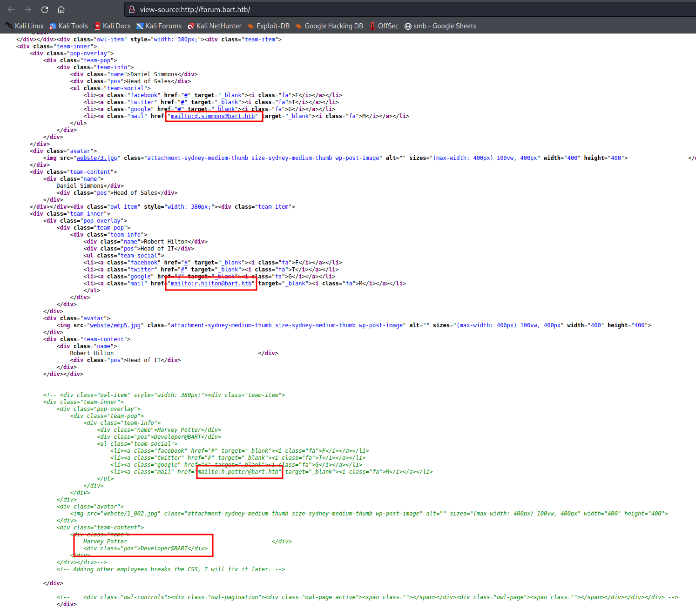
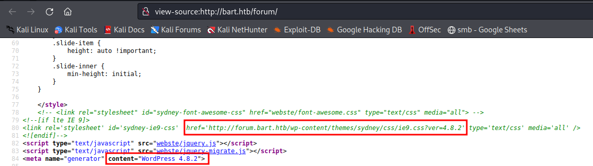
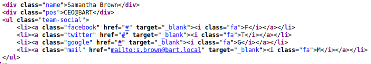
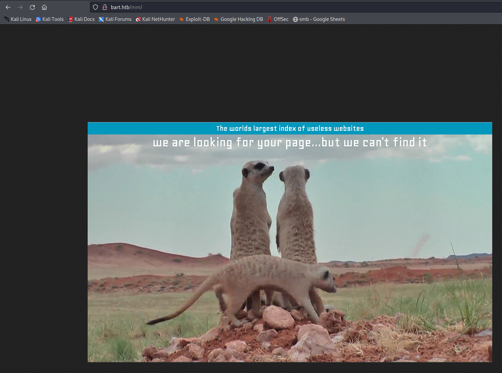
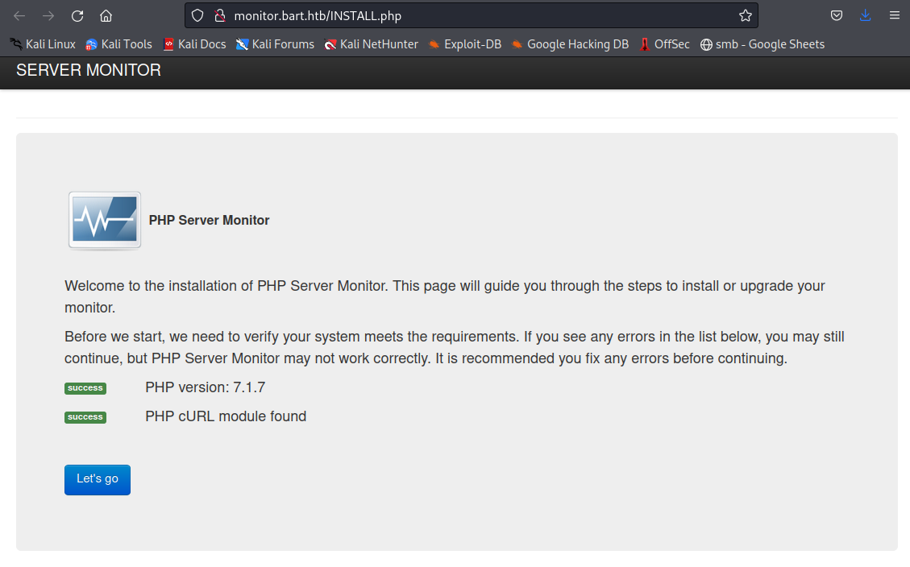

# Recon

I do my initial scan to see which ports are open.

## nmap
```
# Nmap 7.92 scan initiated Fri Aug 19 17:44:03 2022 as: nmap -p- -oA first/scan --min-rate 5000 --max-retries 3 --stylesheet https://raw.githubusercontent.com/honze-net/nmap-bootstrap-xsl/master/nmap-bootstrap.xsl -vv bart.htb
Nmap scan report for bart.htb (10.129.96.185)
Host is up, received echo-reply ttl 127 (0.057s latency).
Scanned at 2022-08-19 17:44:03 CDT for 26s
Not shown: 65534 filtered tcp ports (no-response)
PORT   STATE SERVICE REASON
80/tcp open  http    syn-ack ttl 127

Read data files from: /usr/bin/../share/nmap
# Nmap done at Fri Aug 19 17:44:29 2022 -- 1 IP address (1 host up) scanned in 26.61 seconds
```

Then run `nmap` again with default scripts (`-sC`) and service discovery (`-sV`) on the ports that were found from the first scan.

```
# Nmap 7.92 scan initiated Fri Aug 19 17:44:43 2022 as: nmap -oA main/scan -sV -sC --min-rate 5000 --max-retries 3 --stylesheet https://raw.githubusercontent.com/honze-net/nmap-bootstrap-xsl/master/nmap-bootstrap.xsl -vv -p 80 bart.htb
Nmap scan report for bart.htb (10.129.96.185)
Host is up, received echo-reply ttl 127 (0.066s latency).
Scanned at 2022-08-19 17:44:43 CDT for 9s

PORT   STATE SERVICE REASON          VERSION
80/tcp open  http    syn-ack ttl 127 Microsoft IIS httpd 10.0
|_http-server-header: Microsoft-IIS/10.0
| http-methods: 
|   Supported Methods: OPTIONS TRACE GET HEAD POST
|_  Potentially risky methods: TRACE
|_http-title: Did not follow redirect to http://forum.bart.htb/
|_http-favicon: Unknown favicon MD5: 50465238F8A85D0732CBCC8EB04920AA
Service Info: OS: Windows; CPE: cpe:/o:microsoft:windows

Read data files from: /usr/bin/../share/nmap
Service detection performed. Please report any incorrect results at https://nmap.org/submit/ .
# Nmap done at Fri Aug 19 17:44:52 2022 -- 1 IP address (1 host up) scanned in 9.09 seconds
```

We see IIS 1.0 is running on port 80 and that seems to be it for the services. We also see that it looks like nmap caught a redirect to `forum.bart.htb`, so I'll be sure to enumerate for other subdomains, but first we should add this domain to our `/etc/hosts` so that hopefully our redirect to the forum sub-domain will work.


# wfuzz

```
Target: http://bart.htb/
Total requests: 19966
==================================================================
ID    Response   Lines      Word         Chars          Request    
==================================================================
00023:  C=200    548 L	    2412 W	  35529 Ch	  "forum - forum"
00099:  C=200     80 L	     221 W	   3423 Ch	  "monitor - monitor"
09532:  C=400      6 L	      26 W	    334 Ch	  "#www - #www"
10581:  C=400      6 L	      26 W	    334 Ch	  "#mail - #mail"

Total time: 0
Processed Requests: 19966
Filtered Requests: 19962
Requests/sec.: 0
```




```
Samantha Brown
s.brown@bart.local

Daniel Simmons
d.simmons@bart.htb

Robert Hilton
r.hilton@bart.htb

Harvey Potter
h.potter@bart.htb
```












