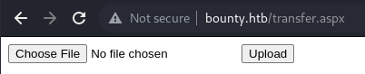
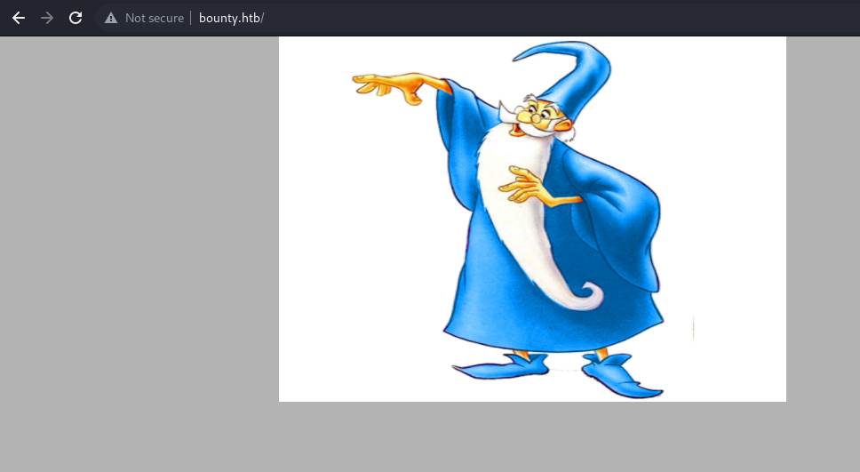
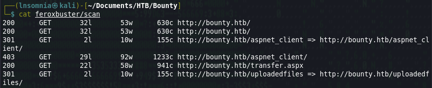
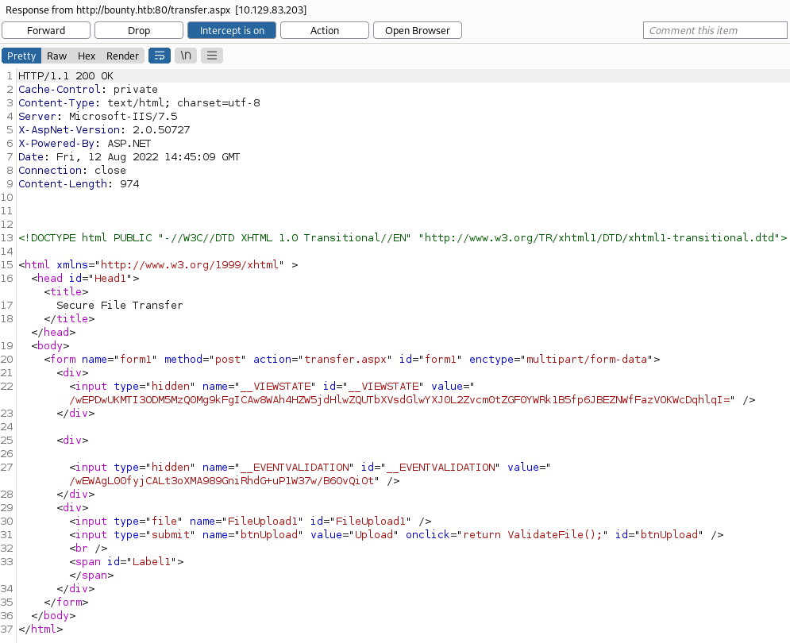

# Recon

I do my initial scan to see which ports are open.

## nmap
```
# Nmap 7.92 scan initiated Thu Aug 11 19:14:08 2022 as: nmap -p- -oA first/scan --min-rate 5000 --max-retries 3 --stylesheet https://raw.githubusercontent.com/honze-net/nmap-bootstrap-xsl/master/nmap-bootstrap.xsl -vv bounty.htb
Nmap scan report for bounty.htb (10.129.83.203)
Host is up, received echo-reply ttl 127 (0.051s latency).
Scanned at 2022-08-11 19:14:08 CDT for 27s
Not shown: 65534 filtered tcp ports (no-response)
PORT   STATE SERVICE REASON
80/tcp open  http    syn-ack ttl 127

Read data files from: /usr/bin/../share/nmap
# Nmap done at Thu Aug 11 19:14:35 2022 -- 1 IP address (1 host up) scanned in 26.61 seconds
```

Then run `nmap` again with default scripts (`-sC`) and service discovery (`-sV`) on the ports that were found from the first scan.

```
# Nmap 7.92 scan initiated Thu Aug 11 19:16:17 2022 as: nmap -oA main/scan -sV -sC --min-rate 5000 --max-retries 3 --stylesheet https://raw.githubusercontent.com/honze-net/nmap-bootstrap-xsl/master/nmap-bootstrap.xsl -vv -p 80 bounty.htb
Nmap scan report for bounty.htb (10.129.83.203)
Host is up, received echo-reply ttl 127 (0.051s latency).
Scanned at 2022-08-11 19:16:17 CDT for 8s

PORT   STATE SERVICE REASON          VERSION
80/tcp open  http    syn-ack ttl 127 Microsoft IIS httpd 7.5
| http-methods: 
|   Supported Methods: OPTIONS TRACE GET HEAD POST
|_  Potentially risky methods: TRACE
|_http-server-header: Microsoft-IIS/7.5
|_http-title: Bounty
Service Info: OS: Windows; CPE: cpe:/o:microsoft:windows

Read data files from: /usr/bin/../share/nmap
Service detection performed. Please report any incorrect results at https://nmap.org/submit/ .
# Nmap done at Thu Aug 11 19:16:25 2022 -- 1 IP address (1 host up) scanned in 8.33 seconds
```

I also ran a UDP scan, vuln scan and fuzzed for subdomains but didn't get much back, so it looks like we are working with Microsoft IIS httpd 7.5 on port 80.

# Enumeration

## Nikto

There really wasn't much from Nikto, although I did make note of the x-aspnet-version header as I thought this could be helpful for later.

```
- Nikto v2.1.6/2.1.5
+ Target Host: bounty.htb
+ Target Port: 80
+ GET Retrieved x-powered-by header: ASP.NET
+ GET The anti-clickjacking X-Frame-Options header is not present.
+ GET The X-XSS-Protection header is not defined. This header can hint to the user agent to protect against some forms of XSS
+ GET The X-Content-Type-Options header is not set. This could allow the user agent to render the content of the site in a different fashion to the MIME type
+ GET Retrieved x-aspnet-version header: 2.0.50727
+ OPTIONS Allowed HTTP Methods: OPTIONS, TRACE, GET, HEAD, POST 
+ OPTIONS Public HTTP Methods: OPTIONS, TRACE, GET, HEAD, POST 
```

## Feroxbuster

`feroxbuster -u http://bounty.htb -x asp,aspx,txt -o scan.txt -w /opt/SecLists/Discovery/Web-Content/raft-small-words.txt`

Feroxbuster discovered an important page: `/transfer.aspx`

```
200      GET       32l       53w      630c http://bounty.htb/
200      GET       32l       53w      630c http://bounty.htb/
301      GET        2l       10w      155c http://bounty.htb/aspnet_client => http://bounty.htb/aspnet_client/
403      GET       29l       92w     1233c http://bounty.htb/aspnet_client/
200      GET       22l       58w      941c http://bounty.htb/transfer.aspx
301      GET        2l       10w      155c http://bounty.htb/uploadedfiles => http://bounty.htb/uploadedfiles/
403      GET       29l       92w     1233c http://bounty.htb/uploadedfiles/
```

## Website

After reviewing our Feroxbuster output we find that we are not able to access `/aspnet_client` or `/uploadedfiles` becase these are behind an authentication mechanism, although we know there is a place for uploaded files to go on the server, and luckily for us, we have a place to upload these files! A reverse shell or web shell might work here.





