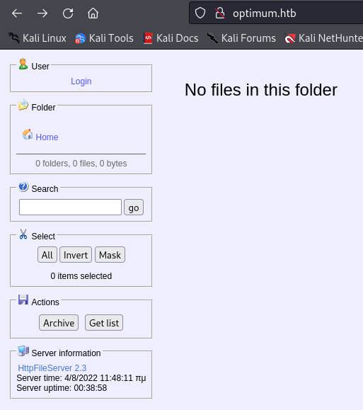
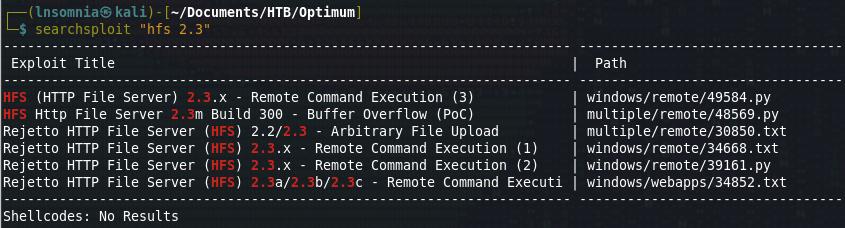
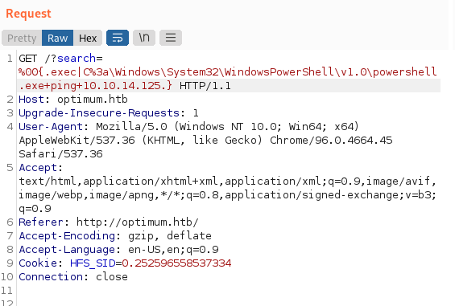
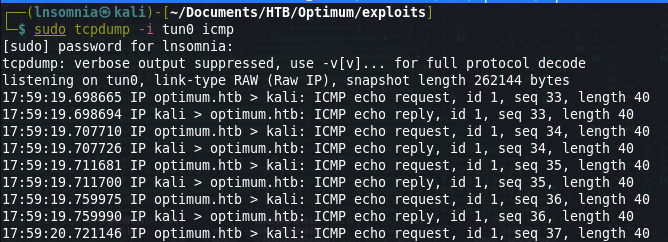
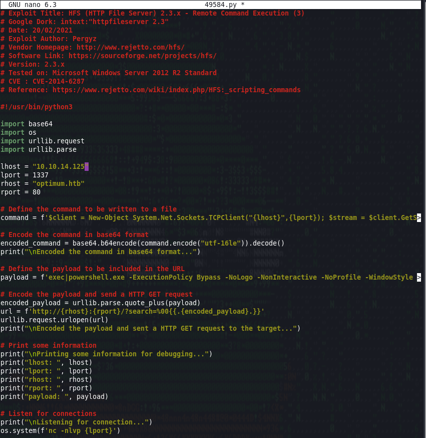

# Recon

I do my initial scan to see which ports are open.
## nmap
```
# Nmap 7.92 scan initiated Thu Jul 28 18:14:08 2022 as: nmap -p- -oA first/scan --min-rate 5000 --max-retries 3 --stylesheet https://raw.githubusercontent.com/honze-net/nmap-bootstrap-xsl/master/nmap-bootstrap.xsl -vv optimum.htb
Nmap scan report for optimum.htb (10.129.1.127)
Host is up, received echo-reply ttl 127 (0.15s latency).
Scanned at 2022-07-28 18:14:08 CDT for 27s
Not shown: 65534 filtered tcp ports (no-response)
PORT   STATE SERVICE REASON
80/tcp open  http    syn-ack ttl 127

Read data files from: /usr/bin/../share/nmap
# Nmap done at Thu Jul 28 18:14:35 2022 -- 1 IP address (1 host up) scanned in 26.83 seconds
```

Then run `nmap` again with default scripts (`-sC`) and service discovery (`-sV`) on the ports that were found from the first scan.

```
# Nmap 7.92 scan initiated Thu Jul 28 18:15:11 2022 as: nmap -oA main/scan -sV -sC --min-rate 5000 --max-retries 3 --stylesheet https://raw.githubusercontent.com/honze-net/nmap-bootstrap-xsl/master/nmap-bootstrap.xsl -vv -p 80 optimum.htb
Nmap scan report for optimum.htb (10.129.1.127)
Host is up, received echo-reply ttl 127 (0.053s latency).
Scanned at 2022-07-28 18:15:12 CDT for 8s

PORT   STATE SERVICE REASON          VERSION
80/tcp open  http    syn-ack ttl 127 HttpFileServer httpd 2.3
| http-methods: 
|_  Supported Methods: GET HEAD POST
|_http-title: HFS /
|_http-favicon: Unknown favicon MD5: 759792EDD4EF8E6BC2D1877D27153CB1
|_http-server-header: HFS 2.3
Service Info: OS: Windows; CPE: cpe:/o:microsoft:windows

Read data files from: /usr/bin/../share/nmap
Service detection performed. Please report any incorrect results at https://nmap.org/submit/ .
# Nmap done at Thu Jul 28 18:15:20 2022 -- 1 IP address (1 host up) scanned in 8.94 seconds
```

I also ran a UDP scan, vuln scan and fuzzed for subdomains but didn't get much back, so it looks like we are working with HttpFileServer httpd 2.3 on port 80.

# Enumeration

## Nikto
Not much from Nikto (the XSS finding was inaccurate)
```
- Nikto v2.1.6
---------------------------------------------------------------------------
+ Target IP:          10.129.1.127
+ Target Hostname:    optimum.htb
+ Target Port:        80
+ Start Time:         2022-07-28 18:14:52 (GMT-5)
---------------------------------------------------------------------------
+ Server: HFS 2.3
+ Cookie HFS_SID created without the httponly flag
+ The anti-clickjacking X-Frame-Options header is not present.
+ The X-XSS-Protection header is not defined. This header can hint to the user agent to protect against some forms of XSS
+ The X-Content-Type-Options header is not set. This could allow the user agent to render the content of the site in a different fashion to the MIME type
+ No CGI Directories found (use '-C all' to force check all possible dirs)
+ OSVDB-38019: /?mod=<script>alert(document.cookie)</script>&op=browse: Sage 1.0b3 is vulnerable to Cross Site Scripting (XSS). http://www.cert.org/advisories/CA-2000-02.html.
+ ERROR: Error limit (20) reached for host, giving up. Last error: opening stream: can't connect (timeout): Operation now in progress
+ Scan terminated:  2 error(s) and 5 item(s) reported on remote host
+ End Time:           2022-07-28 18:42:07 (GMT-5) (1635 seconds)
---------------------------------------------------------------------------
+ 1 host(s) tested
```

## Feroxbuster
no hits...

## Website
There isn't a whole lot to see, although it looks like there is login functionality and file management of some sort. We also see that this is `HttpFileServer 2.3`


A quick searchsploit search on this returns a potential shiny RCE vuln:


Since our attack surface seems relatively small and there doesn't seem to be anything left to enumerate, I'll go ahead and go straight to the exploit...

From some brief reading on HFS, it looks like we can abuse HFS's template macros to achieve remote command execution. I thought this was a great writeup on explaining and testing this vulnerability:
https://vk9-sec.com/hfs-code-execution-cve-2014-6287/

Before I use an exploit script, my curious self first tests to make sure we can ping back to my host. I used Burp and set things up the same way as the author of the above page. I also tried this without an absolute path to powershell and instead just starting the command with ping, but that didn't work, so it looks like an absolute path to powershell is needed.





Now that we have confirmed command execution, I'll modify `49584.py` found from searchsploit. This exploit in particular also spawns a listener on our host for us which is kind of weird to me but it works...



We get a shell back as user `kostas`.

